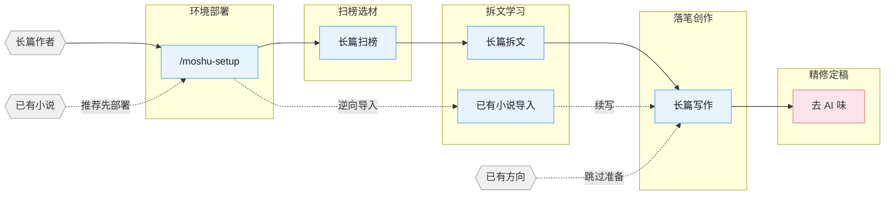

[English](README_EN.md) | **中文**

# mo-shu

长篇网文写作 skill 包，覆盖扫榜、拆文、写作、去AI味的全流程。内置适配 Claude Code。

## 核心思路

> **套路 = 确定性的情绪满足**

专业作者的方法论三步走：

1. **扫榜**：分析热门榜单，洞察题材、人设、切入点。
2. **拆文**：拆解大纲节奏与剧情素材，建立个人模块库。
3. **商业化写作**：学习并运用钩子、爽感、期待感等核心技巧。

围绕四条线展开：爆款逆向 · 剧情模块化重组 · 上下文状态分层管理 · 人机协同。

> **最近更新（v1.0.0）**：本版起专注 Claude Code 单端——移除 OpenCode / Codex / ZCode / OpenClaw / Reasonix / generic 六个适配层；项目更名为 **mo-shu（墨枢）**。更早版本变更见 [CHANGELOG.md](CHANGELOG.md)。

## 流程总览



## 安装

```bash
npx skills add Chained1001/mo-shu -y -g
```

`-g` 全局安装，所有目录可用；去掉 `-g` 只装到当前目录。更新时重新执行同一命令。

安装后，在写作项目根目录运行 `/moshu-setup` 部署。升级后若项目已跑过 `/moshu-setup`，建议重跑一次同步 hooks/agents/references。每版变更见 [CHANGELOG.md](CHANGELOG.md) 与 [Releases](https://github.com/Chained1001/mo-shu/releases)。

**多 agent 协作要先部署再新开会话：** 7 个专业 agent（moshu-architect、moshu-narrative-writer、moshu-consistency-checker 等）由 `/moshu-setup` 写入项目 `.claude/agents/`。Claude Code 在会话启动时更稳定地注册 custom agent。判断是否生效：新会话里跑 `/moshu-review`，报告头是 `Effective Mode: full/lean` 即注册成功，是 `Fallback: ... -> solo` 说明当前运行时未暴露该 agent。

**导入续写顺序：** 推荐先在写作项目根运行 `/moshu-setup`（部署 hooks/agents），新开/刷新会话后运行 `/moshu-import` 导入已有小说，再用 `/moshu-write 日更` 或 `/moshu-write 写第N章` 续写。也可以直接运行 `/moshu-import`；它会先检测是否已 setup，未部署时让你选择先去 setup 或继续串行导入。

## Skills

| Skill | 触发 | 说明 |
|:------|:-----|:-----|
| `moshu-setup` | `/moshu-setup` `/准备写书` | 环境部署 · Claude Code（已有配置安全合并） |
| `moshu` | `/moshu` `/moshu dashboard` | 工具箱路由 · 模糊意图分发 + 本地拆文/项目 Dashboard |
| `moshu-write` | `/moshu-write` `/写长篇` | 长篇写作 · 大纲搭建、人物设定、正文输出 |
| `moshu-analyze` | `/moshu-analyze` | 长篇拆文 · 黄金三章、爽点设计、节奏分析 |
| `moshu-scan` | `/moshu-scan` | 长篇扫榜 · 起点/番茄/晋江市场趋势 |
| `moshu-deslop` | `/moshu-deslop` `/去AI味` | 去AI味 · 检测并清除 AI 写作痕迹 |
| `moshu-import` | `/moshu-import` `/导入小说` | 逆向导入 · 将已有小说反向解析为标准项目结构 |
| `moshu-review` | `/moshu-review` `/审查` | 多视角审查 · 4 Agent 多视角审稿 + 番茄/起点评分标准 |
| `moshu-cdp` | `/moshu-cdp` | 浏览器操控 · CDP 协议复用登录态抓取数据 |

> `moshu-deslop` 的本地检查是写作 lint：blocking 只限确定性句式/标点问题，其他提示按读感判断；朱雀等外部检测只作自测参考，不替代人工读感。

自然语言同样触发：
- 「帮我开书」→ `moshu-write`
- 「这篇太 AI 了」→ `moshu-deslop`
- 「把我的书导进来」→ `moshu-import`
- 「打开工作台」→ `moshu dashboard`（本机浏览拆文库与写作项目，可轻量编辑）
- 「沈栀现在什么状态」→ 自动 spawn `moshu-explorer` agent

### Story Dashboard

运行 `/moshu dashboard` 打开本地写作工作台，浏览拆文库与
长篇项目文件树，并完成搜索、Markdown 预览、文本编辑、冲突保护保存和确认删除。
服务仅监听 `127.0.0.1`，小说内容不会上传。

## Agent 体系

写作 skill 内部通过 7 个专业 Agent 协作，各司其职：

| Agent | 模型 | 职责 |
|:------|:-----|:-----|
| **moshu-architect** | Opus | 故事架构 · 题材定位、大纲结构、钩子/反转设计、情绪弧线 |
| **moshu-character-designer** | Sonnet | 角色设计 · 角色档案、语言风格、动机链、对话创作 |
| **moshu-narrative-writer** | Sonnet | 叙事写手 · 正文写作、去AI味、格式合规 |
| **moshu-consistency-checker** | Haiku | 一致性检查 · 事实冲突扫描、伏笔追踪、S1-S4 分级报告 |
| **moshu-researcher** | Sonnet | 资料研究 · CDP 搜索+正文提取、多源交叉验证、结构化参考文件输出 |
| **moshu-explorer** | Haiku | 故事查询 · 角色/伏笔/设定/进度只读查询，日更上下文快速加载 |
| **moshu-chapter-extractor** | Haiku | 章节提取 · 摘要+情节点+角色提及，并行拆文核心单元 |

Agent 按需加载 `references/` 中的写作理论（角色设计、对话技法、反转工具箱等），部署包 agent-references 含 58 份方法论文件，全仓 references 近 200 份，不预占上下文。

## 自动化 Hooks

`/moshu-setup` 为 Claude Code 部署 8 个自动化 hook：

| Hook | 触发时机 | 功能 |
|:-----|:---------|:-----|
| session-start.sh | 会话开始 | 显示分支、进度快照、拆文状态 |
| session-end.sh | 会话结束 | 记录会话日志到 `追踪/session-log.txt` |
| detect-story-gaps.sh | 会话开始 | 检测设定缺口、大纲缺失、伏笔断线 |
| pre-compact.sh | 上下文压缩前 | 保存进度快照路径和行数摘要 |
| post-compact.sh | 上下文压缩后 | 提示读取进度快照恢复上下文 |
| validate-story-commit.sh | git commit 时 | 检查硬编码属性、设定必填字段（仅警告，不阻断） |
| guard-outline-before-prose.sh | 写正文前（Write/Edit） | 缺对应细纲时阻止首次创建正文（阻断），强制先搭大纲 |
| check-prose-after-write.sh | 正文写入后（Write/Edit） | 轻量扫描截断、工程词、毒句式和字数欠账（提醒，不阻断） |

## 项目文件结构

一部长篇动辄几十万字、几百章。设定冲突、伏笔断线、时间线对不上——写到最后全靠记忆硬撑，迟早翻车。

用文件系统把设定、大纲、正文、追踪拆开，每个维度独立维护。对话只负责创作，不负责记忆。

**长篇：**

```
{书名}/
├── 设定/
│   ├── 世界观/          # 背景、力量体系等，按主题拆文件
│   ├── 角色/            # 每个人物一个文件（江晨.md、钟嘉嘉.md）
│   ├── 势力/            # 每个势力/组织一个文件（火箭军文工团.md）
│   ├── 关系.md          # 角色关系映射
│   └── 题材定位.md      # 题材核心梗+对标分析
├── 大纲/
│   ├── 大纲.md          # 全书卷级结构
│   ├── 卷纲_第一卷.md   # 每卷一个：爽点节奏+情绪弧线+人物弧线+伏笔+反转
│   ├── 细纲_第001章.md  # 每章一个：内容概括+多线情节+人物关系/出场顺序+钩子
│   └── ...
├── 正文/
│   ├── 第001章_章名.md
│   └── ...
├── 对标/                # 对标参考（结构化子目录从拆文库同步）
│   └── {对标书名}/
│       ├── 原文/            # 对标书原文章节
│       ├── 角色/            # 结构化角色卡（从 analyze 输出同步）
│       ├── 剧情/            # 结构化剧情线/节奏/情绪模块（从 analyze 输出同步）
│       ├── 设定/            # 结构化设定（从 analyze 输出同步）
│       ├── 文风.md          # 日更前读取，用来贴近对标书文风
│       └── 拆文报告.md      # analyze skill 输出的拆文报告
├── 追踪/                # 文件优先的连续性状态
│   ├── _tracking-state.json # 唯一结构化权威状态（不进正文 prompt）
│   ├── 上下文.md        # 派生续写状态卡（固定 7 栏，≤12KB）
│   ├── 逐章记录/        # 每章未来相关连续性记录/修订覆盖层（≤3072 bytes）
│   ├── 角色状态/        # 派生核心角色快照（江晨.md、钟嘉嘉.md）
│   ├── 伏笔.md          # 派生伏笔当前视图
│   └── 时间线/          # 派生作者真相.md + 读者已知.md
├── 参考资料/            # moshu-researcher 输出的研究资料
│   └── {topic}.md       # 按研究主题拆分
```

**拆文库：** 拆文 skill 默认输出到项目根目录 `拆文库/{书名}/`，产出结构化目录（角色/剧情/设定/章节），其中长篇剧情目录包含 `节奏.md` 和 `情绪模块.md`，是 analyze 的源数据（source of truth）。写作 skill 通过 `对标/{书名}/剧情/` 等子目录消费这些资产（项目级引用视图），或自动回退读取 `拆文库/`。

**`.active-book`：** 项目根目录的文本文件，内容是当前活跃书目的**相对路径**（如 `长篇/我的小说`），hook 和写作 skill 据此定位当前项目。

## 知识体系

各 skill 自带 `references/` 知识库，按需加载，不占上下文。

<details>
<summary>展开各 skill 知识库主题清单</summary>

| 主题 | 内容 | 所在 skill |
|:-----|:-----|:-----------|
| 大纲排布 | 五步大纲法 · 故事结构分级 · 节点设计法 · 升级感设计 | long-write |
| 开头设计 | 开篇模式 · 前 500 字设计 · 黄金三章开头策略 | long-write |
| 人物设计 | 角色设定 · 人物提取 · 关系映射 · 动机链 · 群像 | long-write |
| 钩子技法 | 章尾钩子 13 式 · 章首钩子 7 式 · 段落级钩子 · 悬念编排 | long-write |
| 情绪设计 | 6 种弧形模板 · 期待感管理 · 题材赛道策略 | long-write |
| 题材框架 | 长篇八节点 · 8 大题材开头模板 | long-write |
| 对话技法 | 节奏 · 潜台词 · 信息控制 · 对话模式数据库 | long-write |
| 反转工具箱 | 类型 · 时机 · 误导底层路径 | long-write |
| 风格模块 | 对话 · 打斗 · 智斗 · 镜头式写作 · 装逼打脸 · 白描 | long-write |
| 高级技法 | 小纲四步法 · 高潮逆推 · 双线结构 · AB 交织法 | long-write |
| 去AI味 | 预防 · 三遍去AI法 · 改写范例库 · 禁用词表 | deslop / long-write |
| 质量检查 | 通用 · 长篇专项 · 毒点排查 | long-write |
| 拆文方法 | 黄金三章 · 情绪曲线 · 结构拆解 | long-analyze |
| 读者画像 | 9 维画像 · 目标读者分析 | long-scan |
| 市场数据 | 题材趋势 · 平台特性 · 采集格式 · 投稿指南 | long-scan |
| 多视角审稿 | 多视角审稿 · 评分标准 · 毒点排查 | moshu-review |

</details>

## 适用平台

**长篇** 起点中文网 · 番茄小说 · 晋江文学城 · 七猫小说 · 刺猬猫

## 致谢

- 本项目基于 [worldwonderer/oh-story-claudecode](https://github.com/worldwonderer/oh-story-claudecode)（MIT License）二次开发，感谢原作者。
- [LINUX DO - The New Ideal Community](https://linux.do) — 社区支持
- [FanqieRankTracker](https://github.com/wen1701/FanqieRankTracker) — 番茄小说字体反爬解码方案参考
- [Zhuque AIGC Detector CLI](https://github.com/Sophomoresty/zhuque) — 去 AI 味实验中的外部复测工具参考
