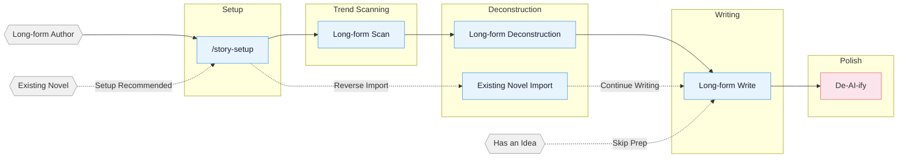
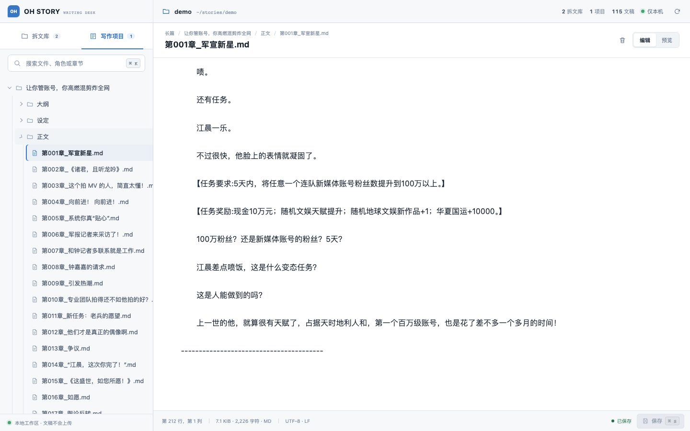

<!-- Last synced with README.md: 2026-08-13 -->

**English** | [中文](README.md)

# mo-shu

A web novel writing skill pack with a built-in adapter for Claude Code. Covers the full pipeline for long-form Chinese web novels: trend scanning, deconstruction, writing, and AI tone removal.

## Core Approach

> **Tropes = deterministic emotional payoff**

Professional authors follow a three-step method:

1. **Scan** — analyze trending charts, identify genres, characters, and entry points.
2. **Deconstruct** — break down pacing and plot materials, build a personal module library.
3. **Commercialize** — learn and apply hooks, payoff density, expectation management.

Built around four pillars: reverse-engineering hits · plot modularization · layered state management · human-AI collaboration.

> **Latest update (v1.0.0):** this release targets Claude Code only — the OpenCode / Codex / ZCode / OpenClaw / Reasonix / generic adapters have been removed; the project is renamed to **mo-shu (墨枢)** and moved to Gitee. See [CHANGELOG.md](CHANGELOG.md) for earlier versions.

## Pipeline Overview



## Installation

```bash
git clone https://gitee.com/chianed1001/mo-shu.git
```

After cloning, run `/story-setup` from your writing project root to deploy. To update, run `git pull` inside the repository directory.

After updating, if a project has already run `/story-setup`, re-run `/story-setup` from the project root to sync hooks / agents / references. Per-version changes are in [CHANGELOG.md](CHANGELOG.md) and [Releases](https://gitee.com/chianed1001/mo-shu/releases).

**Multi-agent collaboration needs setup + a fresh session:** the 7 specialist agents (story-architect, narrative-writer, consistency-checker, etc.) are written into your project's `.claude/agents/` by `/story-setup`. Claude Code registers custom agents most reliably at session start. To check agents: run `/story-review` in the new session — `Effective Mode: full/lean` means agents registered, `Fallback: ... -> solo` means they are unavailable.

**Import and continuation order:** run `/story-setup` from the writing-project root first to deploy hooks and agents; start or refresh the session, then run `/story-import` for the existing novel and continue with `/story-long-write 日更` or `/story-long-write 写第N章`. You can also run `/story-import` directly; if setup is missing, it offers to run setup first or continue with a serial import.

## Skills

| Skill | Trigger | Description |
|:------|:--------|:------------|
| `story-setup` | `/story-setup` | Environment setup — Claude Code (safe merge) |
| `story` | `/story` / `/story dashboard` | Toolbox router plus a local deconstruction/project dashboard |
| `story-long-write` | `/story-long-write` | Long-form writing — outline building, character design, prose output |
| `story-long-analyze` | `/story-long-analyze` | Long-form deconstruction — Golden First 3 Chapters, payoff design, pacing analysis |
| `story-long-scan` | `/story-long-scan` | Long-form trend scan — Qidian/Fanqie/Jinjiang market trends |
| `story-deslop` | `/story-deslop` | De-AI-ify — detect and remove AI writing traces |
| `story-import` | `/story-import` | Reverse import — parse existing novels into standard project structure |
| `story-review` | `/story-review` | Multi-perspective review — 4-agent adversarial review + Fanqie/Qidian scoring rubrics |
| `browser-cdp` | `/browser-cdp` | Browser control — CDP protocol for scraping with reusable login sessions |

> `story-deslop` uses local prose linting: blocking applies only to deterministic style/punctuation issues, while other findings require read-through judgment; external detectors such as Zhuque are self-check references, not replacements for human review.

Natural language also triggers: `帮我开书` ("help me start writing") → `story-long-write`, `这篇太AI了` ("this is too AI-ish") → `story-deslop`, `把我的书导进来` ("import my book") → `story-import`, `打开工作台` ("open the dashboard") → `story dashboard`, `沈栀现在什么状态` ("what's Shen Zhi's current status") → `story-explorer`.

### Story Dashboard

Run `/story dashboard` to open the local writing desk. Browse
deconstruction libraries and long project trees, then search, preview Markdown, edit text,
save with conflict protection, or confirm a file deletion. It listens only on `127.0.0.1` and never
uploads story content.



<details>
<summary>Deconstruction demo — Coiling Dragon</summary>

Full output from `/story-long-analyze` on the first 23 chapters of *Coiling Dragon*:

```
demo/拆文库/盘龙/
├── 概要.md              # Novel overview + chapter index
├── 拆文报告.md           # 5-dimension scoring + payoff density + takeaways
├── 文风.md              # Sentence rhythm, punctuation, dialogue subtext, emotion pacing + anchors
├── 章节/
│   ├── 第1章_深度拆解.md … 第3章_深度拆解.md  # One deep analysis per Golden-3 chapter
│   └── 第1章_摘要.md … 第23章_摘要.md          # One summary file per chapter
├── 角色/
│   ├── 林雷.md           # Protagonist full profile
│   ├── 霍格.md           # Core supporting
│   ├── 希尔曼.md         # Core supporting
│   ├── 希里.md           # Functional character
│   ├── 德林柯沃特.md      # Core supporting
│   ├── 沃顿.md           # Functional character
│   └── 角色关系.md        # Relationship network
├── 剧情/
│   ├── 故事线.md          # Framework recognition + 4 plotlines + single main thread
│   ├── 强者过境与魔法启蒙.md etc.  # Four scene-level plot units
│   ├── 节奏.md            # Pacing + key-info progression + emotional trigger eruption rhythm
│   └── 情绪模块.md        # Reader needs + emotional engine + reusable writing modules
└── 设定/
    ├── 世界观/
    │   ├── 背景设定.md    # Core rules + special settings
    │   ├── 力量体系.md    # Battle qi + magic + ranks
    │   ├── 地理.md        # Andaluxia + Yulan Continent
    │   └── 金手指.md      # Panlong Ring + Delin Cowort
    └── 势力/
        └── 巴鲁克家族.md  # Baluk family (dragon-blood lineage)
```

Long-form deconstruction also produces `文风.md`, plus `剧情/节奏.md` (pacing, key-info progression, emotional trigger eruption rhythm) and `剧情/情绪模块.md` (reader needs, emotional engine, reusable writing modules); daily writing consumes these through `对标/{书名}/剧情/` to keep voice, pacing, and emotion modules close to the benchmark.

</details>

<details>
<summary>Import demo — 让你管账号，你高燃混剪炸全网 (long-form continuation project)</summary>

Run `/story-setup` first, then use `/story-import` to reverse-build the author's already-published first 20 chapters (~37k Chinese chars) into a continuation-ready writing project. Continue with `/story-long-write 日更` or `/story-long-write 写第21章`:

```
demo/长篇/让你管账号，你高燃混剪炸全网/
├── 正文/        Chapters 001–020 (published source text)
├── 大纲/        大纲.md · 卷纲_第1卷.md · 细纲_第001–020章.md (one file per chapter)
├── 设定/        角色/ (6 character files) · 世界观/{background · cheat-system}
│                关系.md · 题材定位.md · 文风.md
└── 追踪/        _tracking-state.json · 上下文.md · 伏笔.md · 角色状态/{角色名}.md · 时间线/{作者真相.md · 读者已知.md}
```

Per-chapter extraction (events / characters / settings / foreshadowing / timeline) is reverse-engineered into a continuation bible, so the author seamlessly continues from chapter 21.

</details>

## Agent System

Writing skills internally coordinate 7 specialized agents:

| Agent | Model | Role |
|:------|:------|:-----|
| **story-architect** | Opus | Story architecture — genre positioning, outline structure, hook/twist design, emotion arcs |
| **character-designer** | Sonnet | Character design — profiles, voice, motivation chains, dialogue writing |
| **narrative-writer** | Sonnet | Narrative writer — prose writing, de-AI-ify, format compliance |
| **consistency-checker** | Haiku | Consistency check — fact conflict scanning, foreshadowing tracking, S1-S4 grading reports |
| **story-researcher** | Sonnet | Research — CDP search + full-text extraction, multi-source cross-verification, structured reference files |
| **story-explorer** | Haiku | Story query — read-only character/foreshadowing/setting/progress lookup, quick context loading |
| **chapter-extractor** | Haiku | Chapter extraction — summaries, plot points, character mentions, parallel deconstruction unit |

Agents load writing theory from `references/` on demand (character design, dialogue techniques, twist toolbox, etc. — 58 methodology files in the agent-references bundle, nearly 200 references across the repo), without reserving context window space.

## Automation Hooks

`/story-setup` deploys 8 automation hooks for Claude Code:

| Hook | Trigger | Function |
|:-----|:---------|:---------|
| session-start.sh | Session start | Display branch, progress snapshot, deconstruction status |
| session-end.sh | Session end | Log session to `追踪/session-log.txt` |
| detect-story-gaps.sh | Session start | Detect setting gaps, missing outlines, foreshadowing breaks |
| pre-compact.sh | Before context compaction | Save progress snapshot path and line-count summary |
| post-compact.sh | After context compaction | Prompt to read progress snapshot for context recovery |
| validate-story-commit.sh | git commit | Check hardcoded attributes, setting required fields (warning only, non-blocking) |
| guard-outline-before-prose.sh | Before writing prose (Write/Edit) | Blocks first creation of a chapter body when its 细纲 (chapter outline) is missing (blocking) — enforces outline-first |
| check-prose-after-write.sh | After writing prose (Write/Edit) | Lightly scan for truncation, leaked workflow terms, deterministic toxic phrasing, and word-count debt (advisory) |

## Project File Structure

A long-form novel can easily reach hundreds of thousands of words across hundreds of chapters. Setting conflicts, broken foreshadowing, timeline inconsistencies — relying on memory alone is a recipe for disaster.

The file system separates settings, outlines, prose, and tracking into independent dimensions. The conversation handles creation; the file system handles memory.

**Long-form:**

```
{Book Title}/
├── 设定/ (Settings)
│   ├── 世界观/          # World: background, power systems, etc. — one file per topic
│   ├── 角色/            # Characters: one file per person (江晨.md, 钟嘉嘉.md)
│   ├── 势力/            # Factions: one file per faction/organization (火箭军文工团.md)
│   ├── 关系.md          # Character relationship map
│   └── 题材定位.md      # Genre core trope + benchmark analysis
├── 大纲/ (Outline)
│   ├── 大纲.md          # Full-book volume-level structure
│   ├── 卷纲_第一卷.md   # One per volume: payoff pacing + emotion arc + character arc + foreshadowing + twists
│   ├── 细纲_第001章.md  # One per chapter: summary + multi-line plot + relationships/order + hooks
│   └── ...
├── 正文/ (Prose)
│   ├── 第001章_章名.md
│   └── ...
├── 对标/ (Benchmark)    # Benchmark reference (structured subdirs synced from deconstruction)
│   └── {对标书名}/
│       ├── 原文/            # Benchmark book original chapters
│       ├── 角色/            # Structured character profiles (synced from analyze)
│       ├── 剧情/            # Structured plot lines/pacing/emotion modules (synced from analyze)
│       ├── 设定/            # Structured world settings (synced from analyze)
│       ├── 文风.md          # Benchmark voice read before daily writing
│       └── 拆文报告.md      # Analyze skill output
├── 追踪/ (Tracking)    # File-first continuity state
│   ├── _tracking-state.json # Single structured authority (not loaded into prose prompts)
│   ├── 上下文.md        # Derived hot context (7 fixed sections, ≤12 KB)
│   ├── 逐章记录/        # Compact continuity record / revision overlay (≤3072 bytes)
│   ├── 角色状态/        # Derived snapshot per core character
│   ├── 伏笔.md          # Derived current foreshadowing view
│   └── 时间线/          # Derived author-truth and reader-known views
├── 参考资料/ (References) # story-researcher output
│   └── {topic}.md       # Split by research topic
```

**Deconstruction Library:** Deconstruction skills save structured outputs (characters, plotlines, settings, chapters) under `拆文库/{Book Title}/` at project root; long-form plot output includes `节奏.md` and `情绪模块.md`. Writing skills consume these assets through `对标/{书名}/剧情/` and related benchmark subdirectories, or automatically fall back to reading from the deconstruction library.

**`.active-book`:** a text file at project root containing the active book's relative path (for example, `长篇/My Novel`). Hooks and writing skills use it to locate the current project.

## Knowledge Base

Each skill includes a `references/` knowledge base loaded on demand to keep context lean.

<details>
<summary>Expand the per-skill knowledge-base topic list</summary>

| Topic | Contents | Skill |
|:------|:---------|:------|
| Outline Layout | Five-step outline method · Story structure levels · Node design · Progression design | long-write |
| Opening Design | Opening patterns · First 500 words · Golden First 3 Chapters | long-write |
| Character Design | Character profiles · Character extraction · Relationship mapping · Motivation chains · Ensemble casts | long-write |
| Hook Techniques | 13 chapter-end hooks · 7 chapter-start hooks · Paragraph-level hooks · Suspense orchestration | long-write |
| Emotion Design | 6 arc templates · Expectation management · Genre track strategies | long-write |
| Genre Frameworks | Long-form 8-node · 8 genre opening templates | long-write |
| Dialogue Techniques | Rhythm · Subtext · Information control · Dialogue pattern database | long-write |
| Twist Toolbox | Types · Timing · Misdirection base paths | long-write |
| Style Modules | Dialogue · Combat · Mind games · Cinematic writing · Face-slapping · Plain description | long-write |
| Advanced Techniques | 4-step micro-outline · Climax reverse-engineering · Dual-thread structure · AB interweaving | long-write |
| De-AI-ify | Prevention · 3-pass de-AI method · Rewrite examples · Banned word list | deslop / long-write |
| Quality Checks | General · Long-form specific · Toxic trope detection | long-write |
| Deconstruction Methods | Golden First 3 Chapters · Emotion curves · Structure breakdown | long-analyze |
| Reader Profiles | 9-dimension profiles · Target reader analysis | long-scan |
| Market Data | Genre trends · Platform characteristics · Collection formats · Submission guides | long-scan |
| Adversarial Review | Multi-perspective review · Scoring rubrics · Toxic trope detection | story-review |

</details>

## Supported Platforms

**Long-form** Qidian (起点中文网) · Fanqie Novels (番茄小说) · Jinjiang (晋江文学城) · Qimao (七猫小说) · Ciweimao (刺猬猫)

Real output samples are in [demo/](demo/): long-form deconstruction 《盘龙》 · long-form continuation project 《让你管账号，你高燃混剪炸全网》

I built this skill pack to help me through a job-hunting transition :joy:, and I hope it can help others too.

## Contributing

Contributions are welcome — new skills, knowledge base additions, market data updates. See [CONTRIBUTING.md](CONTRIBUTING.md) (Chinese only).

## Community

- **Telegram**: <https://t.me/ohstoryclaudecode> — chat, troubleshooting, and feature discussion.
- **GitHub Discussions**: [ask questions, get help, share workflows](https://gitee.com/chianed1001/mo-shu/discussions).

## Acknowledgments

- This project is a fork of [worldwonderer/oh-story-claudecode](https://github.com/worldwonderer/oh-story-claudecode) (MIT License). Thanks to the original author.
- [LINUX DO - The New Ideal Community](https://linux.do) — Community support
- [FanqieRankTracker](https://github.com/wen1701/FanqieRankTracker) — Fanqie Novels font obfuscation decoding reference
- [Zhuque AIGC Detector CLI](https://github.com/Sophomoresty/zhuque) — External retest reference used during anti-AI-writing experiments
