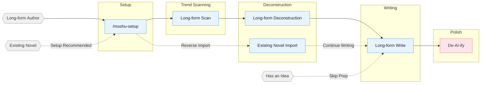

<!-- Last synced with README.md: 2026-08-21 -->

**English** | [中文](README.md)

# mo-shu

A web novel writing skill pack with a built-in adapter for Claude Code. Covers the full pipeline for long-form Chinese web novels: trend scanning, deconstruction, writing, and AI tone removal.

## Core Approach

> **Tropes = deterministic emotional payoff**

Professional authors follow a three-step method:

1. **Scan** — analyze trending charts, identify genres, characters, and entry points.
2. **Deconstruct** — break down pacing and plot materials, build a personal module library.
3. **Commercialize** — learn and apply hooks, payoff density, expectation management.

Built around four pillars: reverse-engineering hits · plot modularization · layered state management · human-AI collaboration.

> **Latest (v2.4.0)**: **Create-Review-Research Loop** — Review Agent (moshu-evaluator, 3-dimension read-only, routine at stop points) + Multi-dimension research triggers (Stage 2-6 bottleneck signals + context-specific fusion) + Socratic methodology (design questions replace checklists · fill-in-blank templates) + Stage naming standardization + Machine-check format tolerance + Hot-cold separation optimization + **Full-repo audit fix loop (B31-B45)** — version-scatter closure, shared-assets full reconciliation guard, contract layer single-source-of-truth (deployment manifest / artifact fields / flow anchors), write three-workflow lane IDs, audit guard-ification loop (Audit SOP v1.7 + Dev Standard v1.3) + agents_version 34 (8 agents). **v2.2-2.3 core**: Five-layer pipeline (8-column skeleton / faction web / darkline layers / stage evolution / subplot+spotlight) + Three-novel reverse extraction + Outline machine-check + Research skill agent-ified + 17 batches.

## Pipeline Overview



## Installation

```bash
npx skills add Chained1001/mo-shu -y -g
```

`-g` installs globally (available in every directory); drop `-g` to install only into the current directory. Re-run the same command to update.

**Open a new Claude Code session after installing** (skills are loaded at session start; a session that was open before the install may not be able to trigger `/moshu-setup`), then run `/moshu-setup` from your writing project root to deploy. Open yet another fresh session before writing (see the agents note below). After updating, re-run `/moshu-setup` to sync hooks / agents / references. Per-version changes are in [CHANGELOG.md](CHANGELOG.md) and [Releases](https://github.com/Chained1001/mo-shu/releases).

**Multi-agent collaboration needs setup + a fresh session:** the 8 specialist agents (moshu-architect, moshu-narrative-writer, moshu-consistency-checker, etc.) are written into your project's `.claude/agents/` by `/moshu-setup`. Claude Code registers custom agents most reliably at session start. To check agents: run `/moshu-review` in the new session — `Effective Mode: full/lean` means agents registered, `Fallback: ... -> solo` means they are unavailable.

**Import and continuation order:** run `/moshu-setup` from the writing-project root first to deploy hooks and agents; start or refresh the session, then run `/moshu-import` for the existing novel and continue with `/moshu-write 日更` or `/moshu-write 写第N章`. You can also run `/moshu-import` directly; if setup is missing, it offers to run setup first or continue with a serial import.

### Post-Install Steps (New Users Read This)

| Step | What to Do | Why |
|---|---|---|
| **① New Window** | After installation, **close the current Claude Code window and open a new one** in your writing directory | Skills load at session start — `/moshu-build` etc. won't work in the install session |
| **② Deploy Environment** | Run `/moshu-setup` in the new window | Deploys hooks, agents, rules, CLAUDE.md to your writing project |
| **③ New Window Again** | After setup, open another new window and start `/moshu-build` | Agents register at session start, not available in the setup session |


## Skills

| Skill | Trigger | Description |
|:------|:--------|:------------|
| `moshu-setup` | `/moshu-setup` | Environment setup — Claude Code (safe merge) |
| `moshu` | `/moshu` / `/moshu dashboard` | Toolbox router plus a local deconstruction/project dashboard |
| `moshu-write` | `/moshu-write` | Long-form writing — chapter outlines and prose, daily continuation, revision, volume-review execution |
| `moshu-build` | `/moshu-build` | Book construction — Stage 1-6 six-step flow (ideal review → 8-column skeleton → character arcs → unit cards → integration → finalize), three-dimension review, embedded research (Stage 1 default + bottleneck-triggered), setting revision, new-volume planning |
| `moshu-analyze` | `/moshu-analyze` | Long-form deconstruction — Golden First 3 Chapters, payoff design, pacing analysis |
| `moshu-scan` | `/moshu-scan` | Long-form trend scan — Qidian/Fanqie/Jinjiang market trends |
| `moshu-deslop` | `/moshu-deslop` | De-AI-ify — detect and remove AI writing traces |
| `moshu-style` | `/moshu-style` | Style learning — extract a writing-style baseline (sentence length / punctuation / dialogue technique / anchor excerpts) from any amount of source text into `文风库/文风.md` |
| `moshu-import` | `/moshu-import` | Reverse import — parse existing novels into standard project structure |
| `moshu-review` | `/moshu-review` | Multi-perspective review — 4-agent adversarial review + Fanqie/Qidian scoring rubrics |
| `moshu-cdp` | `/moshu-cdp` | Browser control — CDP protocol for scraping with reusable login sessions |

> `moshu-deslop` uses local prose linting: blocking applies only to deterministic style/punctuation issues, while other findings require read-through judgment; external detectors such as Zhuque are self-check references, not replacements for human review.

Natural language also triggers: `帮我开书` ("help me start writing") → `moshu-build` (outlines & prose continue in `moshu-write`), `这篇太AI了` ("this is too AI-ish") → `moshu-deslop`, `把我的书导进来` ("import my book") → `moshu-import`, `打开工作台` ("open the dashboard") → `moshu dashboard`, `沈栀现在什么状态` ("what's Shen Zhi's current status") → `moshu-explorer`.

### Story Dashboard

Run `/moshu dashboard` to open the local writing desk. Browse
deconstruction libraries and long project trees, then search, preview Markdown, edit text,
save with conflict protection, or confirm a file deletion. It listens only on `127.0.0.1` and never
uploads moshu content.

## Agent System

Writing skills internally coordinate 8 specialized agents:

| Agent | Model | Role |
|:------|:------|:-----|
| **moshu-architect** | Opus | Story architecture — genre positioning, outline structure, hook/twist design, emotion arcs |
| **moshu-character-designer** | Sonnet | Character design — profiles, voice, motivation chains, dialogue writing |
| **moshu-narrative-writer** | Sonnet | Narrative writer — prose writing, de-AI-ify, format compliance |
| **moshu-consistency-checker** | Haiku | Consistency check — fact conflict scanning, foreshadowing tracking, S1-S4 grading reports |
| **moshu-researcher** | Sonnet | Research — CDP search + full-text extraction, multi-source cross-verification, structured reference files |
| **moshu-explorer** | Haiku | Story query — read-only character/foreshadowing/setting/progress lookup, quick context loading |
| **moshu-chapter-extractor** | Haiku | Chapter extraction — summaries, plot points, character mentions, parallel deconstruction unit |
| **moshu-evaluator** | Sonnet | Creation review — read-only three-dimension (editor/author/reader) review of build artifacts, routine call at stop points |

Agents load writing theory from `references/` on demand (character design, dialogue techniques, twist toolbox, etc. — the agent-references bundle ships the full methodology set, which grows with each version; hundreds of references across the repo), without reserving context window space.

## Automation Hooks

`/moshu-setup` deploys 8 automation hooks for Claude Code:

| Hook | Trigger | Function |
|:-----|:---------|:---------|
| session-start.sh | Session start | Display branch, progress snapshot, deconstruction status |
| session-end.sh | Session end | Log session to `追踪/session-log.txt` |
| detect-story-gaps.sh | Session start | Detect setting gaps, missing outlines, foreshadowing breaks |
| pre-compact.sh | Before context compaction | Save progress snapshot path and line-count summary |
| post-compact.sh | After context compaction | Prompt to read progress snapshot for context recovery |
| validate-story-commit.sh | git commit | Check hardcoded attributes, setting required fields (warning only, non-blocking) |
| guard-outline-before-prose.sh | Before writing prose (Write/Edit) | Blocks first creation of a chapter body when its 细纲 (chapter outline) is missing (blocking) — enforces outline-first |
| check-prose-after-write.sh | After writing prose (Write/Edit) | Lightly scan for truncation, leaked workflow terms, deterministic toxic phrasing, and word-count debt (advisory) |

## Project File Structure

A long-form novel can easily reach hundreds of thousands of words across hundreds of chapters. Setting conflicts, broken foreshadowing, timeline inconsistencies — relying on memory alone is a recipe for disaster.

The file system separates settings, outlines, prose, and tracking into independent dimensions. The conversation handles creation; the file system handles memory.

**Long-form:**

```
{Book Title}/
├── 设定/ (Settings)
│   ├── 世界观/          # World: background, power systems, etc. — one file per topic
│   ├── 角色/            # Characters: one file per person (江晨.md, 钟嘉嘉.md)
│   ├── 势力/            # Factions: one file per faction/organization (火箭军文工团.md)
│   ├── 关系.md          # Character relationship map
│   ├── 题材定位.md      # Genre core trope + benchmark analysis + endgame trump card
│   ├── 理想书评.md      # Full-book north-star yardstick (Stage 1 output)
│   ├── 题材正文提示卡.md  # Genre boundaries / payoff points / no-drift
│   ├── 构建台账.md      # Six-step status / build state / open items / emergence log
│   ├── 角色弧线.md      # Six arc types × six stages + emotion engine + low-pressure side
│   └── 采风-CF*.md      # Research artifacts (five types × seven sources, CF ticket system)
├── 大纲/ (Outline)
│   ├── 大纲.md          # Full-book skeleton (8-column table + faction web + darkline + standing pressure + upgrade steps)
│   ├── 角色弧线.md      # Character arcs (Stage 3 output; same as 设定/角色弧线.md)
│   ├── 单元卡.md        # First-volume plot units (BC-ID chapter function + subplot registration + supporting-character spotlight)
│   ├── 整合记录.md      # Foreshadowing 4 states + twists + clue matrix + motivation chains + Stage 6 polish record
│   ├── 变更日志.md      # Append-only change log
│   ├── 卷纲_第一卷.md   # One per volume: final v1.0
│   ├── 细纲_第001章.md  # One per chapter: summary + multi-line plot + relationships/order + hooks
│   └── ...
├── 正文/ (Prose)
│   ├── 第001章_章名.md
│   └── ...
├── 对标/ (Benchmark)    # Benchmark reference (structured subdirs synced from deconstruction)
│   └── {对标书名}/
│       ├── 原文/            # Benchmark book original chapters
│       ├── 角色/            # Structured character profiles (synced from analyze)
│       ├── 剧情/            # Structured plot lines/pacing/emotion modules (synced from analyze)
│       ├── 设定/            # Structured world settings (synced from analyze)
│       ├── 技法总结.md      # Analyze Stage 2-7 output (emotion alternation/techniques/imitating layers)
│       └── 拆文报告.md      # Analyze skill output
├── 文风库/ (Style)       # Writing style (/moshu-style generates; recalled before each chapter)
│   └── 文风.md            # Sentence length/punctuation/dialogue anchors (learnable from any text)
├── 追踪/ (Tracking)    # File-first continuity state
│   ├── _tracking-state.json # Single structured authority (not loaded into prose prompts)
│   ├── 上下文.md        # Derived hot context (7 fixed sections, ≤12 KB)
│   ├── 逐章记录/        # Compact continuity record / revision overlay (≤3072 bytes)
│   ├── 角色状态/        # Derived snapshot per core character
│   ├── 伏笔.md          # Derived current foreshadowing view
│   └── 时间线/          # Derived author-truth and reader-known views
├── 参考资料/ (References) # moshu-researcher output
│   └── {topic}.md       # Split by research topic
```

**Deconstruction Library:** Deconstruction skills save structured outputs (characters, plotlines, settings, chapters) under `拆文库/{Book Title}/` at project root; long-form plot output includes `节奏.md` and `情绪模块.md`. Writing skills consume these assets through `对标/{书名}/剧情/` and related benchmark subdirectories, or automatically fall back to reading from the deconstruction library.

**`.active-book`:** a text file at project root containing the active book's relative path (for example, `长篇/My Novel`). Hooks and writing skills use it to locate the current project.

## Knowledge Base

Each skill includes a `references/` knowledge base loaded on demand to keep context lean.

<details>
<summary>Expand the per-skill knowledge-base topic list</summary>

| Topic | Contents | Skill |
|:------|:---------|:------|
| Outline Layout | Five-step outline method · Story structure levels · Node design · Progression design | moshu-write |
| Opening Design | Opening patterns · First 500 words · Golden First 3 Chapters | moshu-write |
| Character Design | Character profiles · Character extraction · Relationship mapping · Motivation chains · Ensemble casts | moshu-write |
| Hook Techniques | 14 chapter-end hooks · 7 chapter-start hooks · Paragraph-level hooks · Suspense orchestration | moshu-write |
| Emotion Design | 6 arc templates · Expectation management · Genre track strategies | moshu-write |
| Genre Frameworks | Long-form 8-node · 8 genre opening templates | moshu-write |
| Dialogue Techniques | Rhythm · Subtext · Information control · Dialogue pattern database | moshu-write |
| Twist Toolbox | Types · Timing · Misdirection base paths | moshu-write |
| Style Modules | Dialogue · Combat · Mind games · Cinematic writing · Face-slapping · Plain description | moshu-write |
| Advanced Techniques | 4-step micro-outline · Climax reverse-engineering · Dual-thread structure · AB interweaving | moshu-write |
| De-AI-ify | Prevention · 3-pass de-AI method · Rewrite examples · Banned word list | deslop / moshu-write |
| Quality Checks | General · Long-form specific · Toxic trope detection | moshu-write |
| Deconstruction Methods | Golden First 3 Chapters · Emotion curves · Structure breakdown | moshu-analyze |
| Reader Profiles | 9-dimension profiles · Target reader analysis | moshu-scan |
| Market Data | Genre trends · Platform characteristics · Collection formats · Submission guides | moshu-scan |
| Adversarial Review | Multi-perspective review · Scoring rubrics · Toxic trope detection | moshu-review |

</details>

## Supported Platforms

**Long-form** Qidian (起点中文网) · Fanqie Novels (番茄小说) · Jinjiang (晋江文学城) · Qimao (七猫小说) · Ciweimao (刺猬猫)

## Acknowledgments

- This project is a fork of [worldwonderer/oh-story-claudecode](https://github.com/worldwonderer/oh-story-claudecode) (MIT License). Thanks to the original author.
- [LINUX DO - The New Ideal Community](https://linux.do) — Community support
- [FanqieRankTracker](https://github.com/wen1701/FanqieRankTracker) — Fanqie Novels font obfuscation decoding reference
- [Zhuque AIGC Detector CLI](https://github.com/Sophomoresty/zhuque) — External retest reference used during anti-AI-writing experiments
