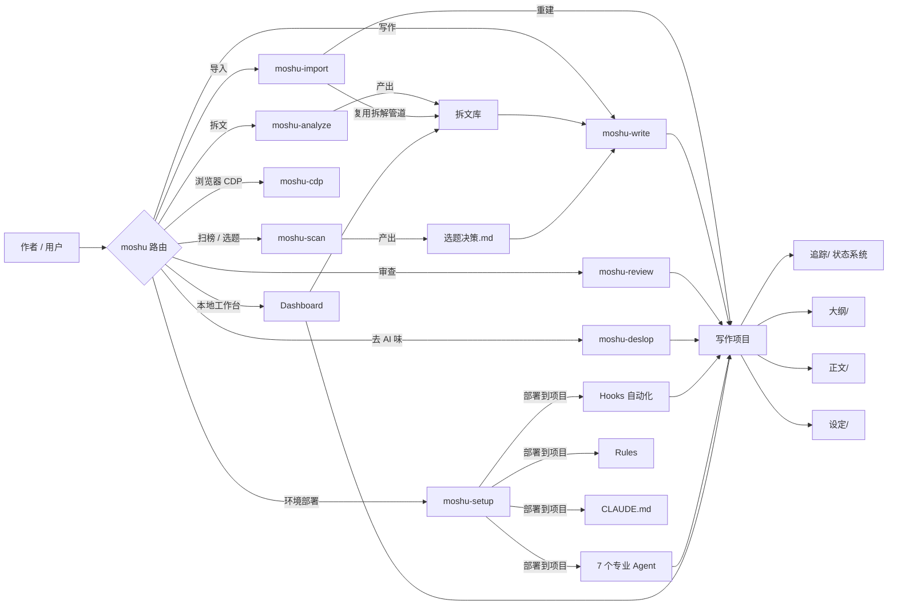
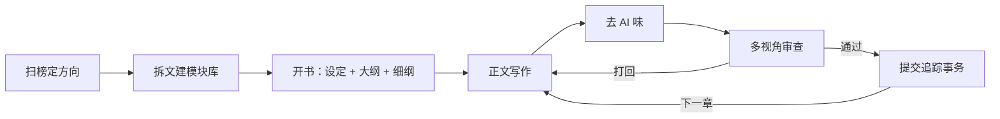
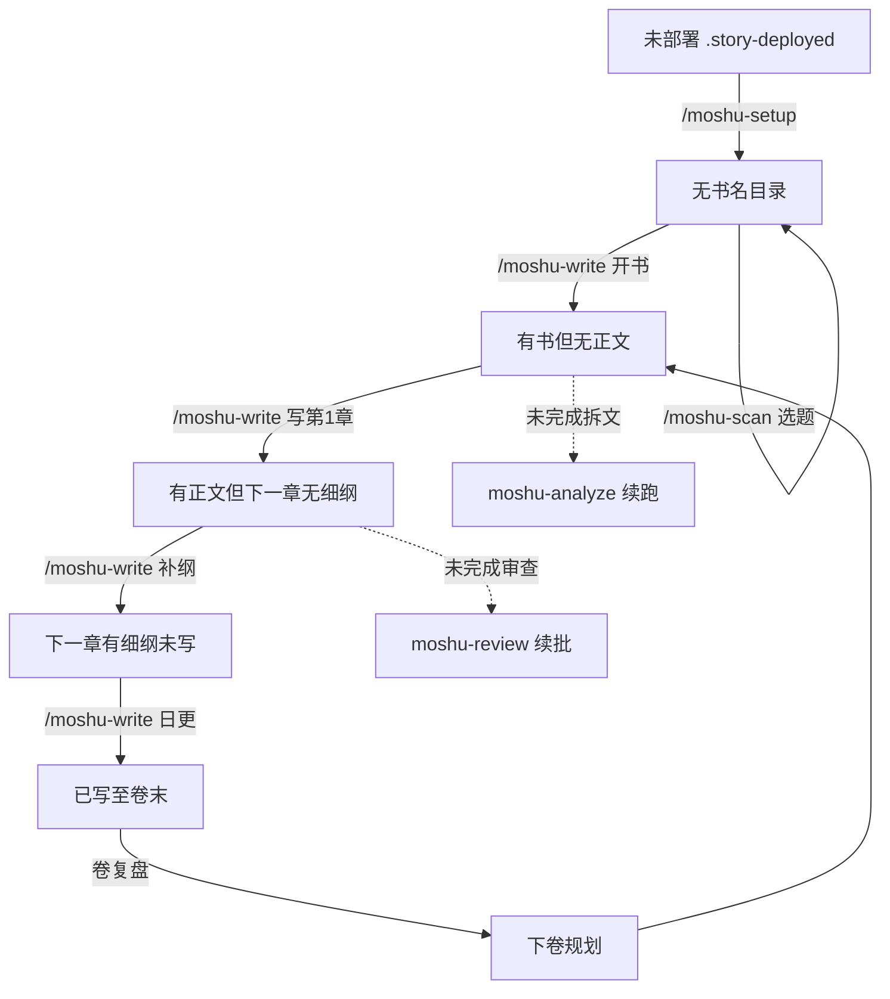
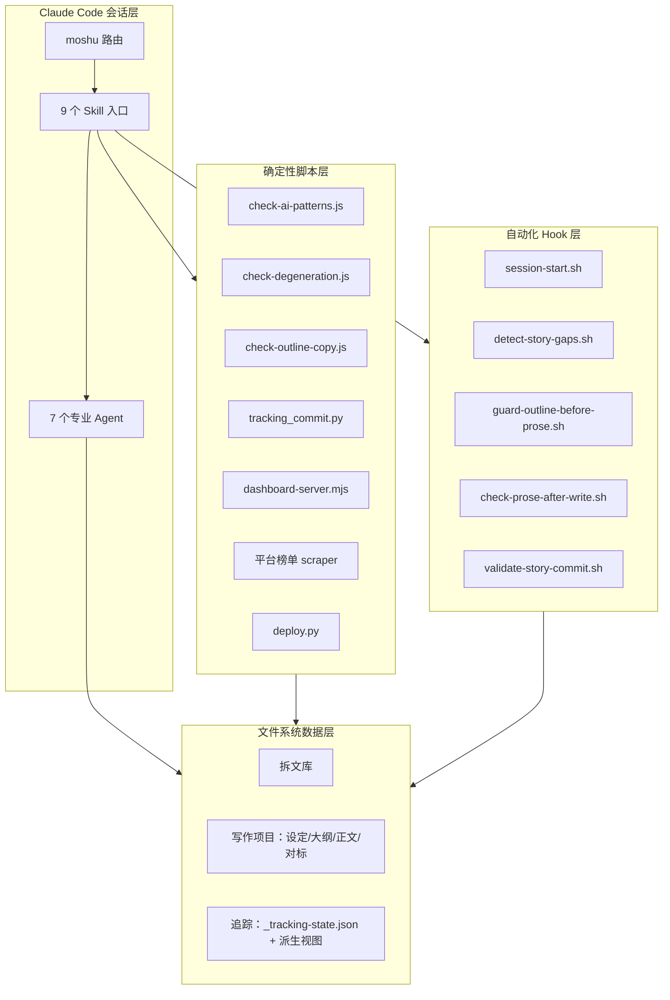

# mo-shu 架构图

> 本文件用 Mermaid 描述 mo-shu 的整体架构、写作流水线与“下一步”状态机。
> 在 GitHub / Claude Code 中可直接渲染；也可用支持 Mermaid 的编辑器查看。

## 1. 总览：用户入口 → Skill → 脚本/Agent → 文件系统

## 2. 写作流水线

## 3. “下一步”状态机（moshu 路由判定）

## 4. 分层架构

## 5. 关键设计说明

- **三层分工**：脚本做确定性（统计/检测/事务），AI 做语义（写作/审查/大纲），作者做品味（确认/裁决/复盘）。
- **文件即记忆**：`追踪/_tracking-state.json` 是唯一结构化权威，`上下文.md`/`伏笔.md`/`角色状态/` 等均为派生视图，由 `tracking_commit.py` 统一维护。
- **Agent 可降级**：custom agent 未部署或 spawn 失败时，所有 skill 自动降级 solo/direct，保证流程不中断。
- **Hook 是兜底网**：即使主会话漏跑质量收尾，写入前/写入后的 hook 也会拦截或提醒关键问题。
- **共享资产防漂移**：`scripts/shared-assets.json` 管理 36 组跨 skill 共享副本，`scripts/check-shared-files.sh` 保证字节一致。
- **文档预算防膨胀**：`scripts/doc-budget.json` 限制每次会话必读的热路径文本量。
