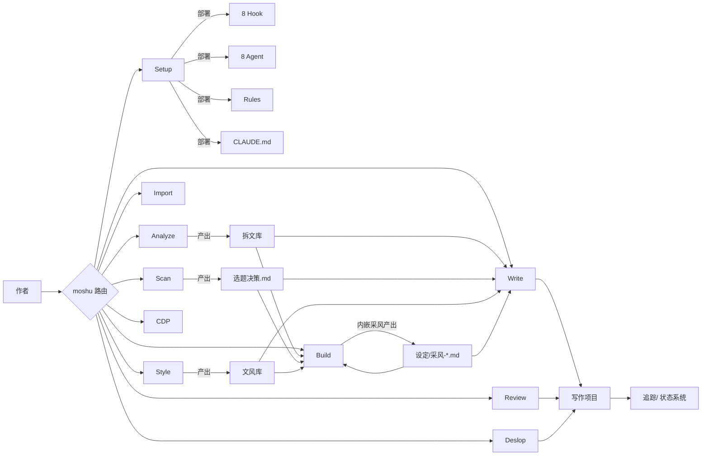
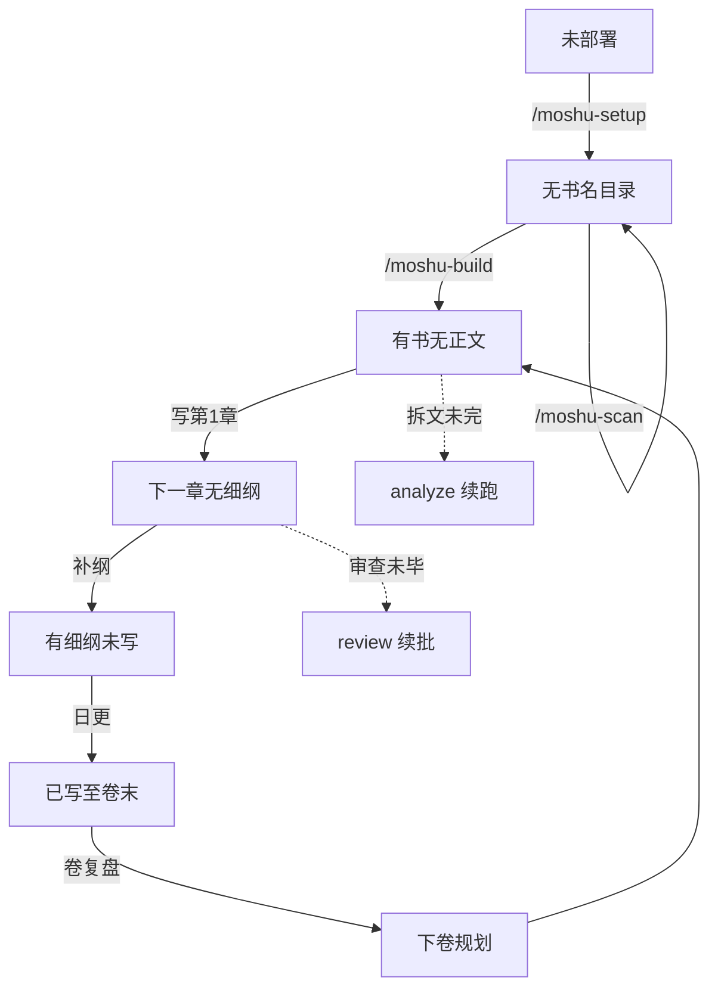
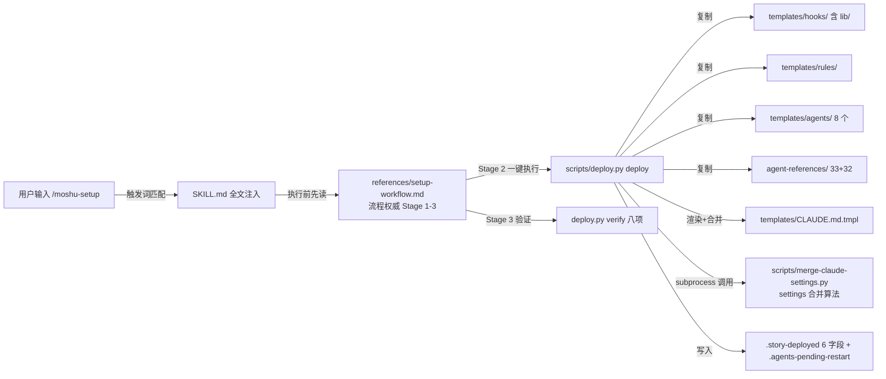
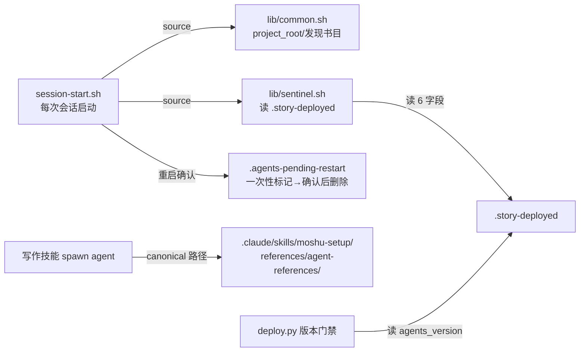

# 《mo-shu 项目 - 产品需求与详细设计文档（PRD+FSD）》

> 版本：v3.0（2026-08-25）· 单文件高阶完整版（PRD 内嵌 FSD 技术细节）｜基线：v2.3.7 已发｜定位：**给小白能看懂的项目全书 + 后续开发的规范蓝本**
> 阅读指南：新手从第一部分读起；开发者 Ⅰ→Ⅲ→Ⅳ；改代码前先过 Ⅲ.18 自检清单。
> 性质声明：全文汇编自活区真源、**不产生新事实**——机制真源是各 SKILL.md 与 references，工程规范真源是 `docs/治理/开发标准.md`；本文与真源不一致时以真源为准（附录 B 对照表）。原 `docs/architecture.md` 已被本文 Ⅲ.9 吸收取代。

---

# 第一部分 设计理念与概念词典

## 1.1 六条设计理念（每条附「违反了会长什么样」）

1. **三层分工：脚本做确定性、AI 做语义、作者做品味。** 字数统计、格式检查、状态写入这类可判定的事交给脚本；写作、审查、大纲设计交给 AI；确认、裁决、复盘永远留给作者。违反样式：让 AI「自觉」数字数、让脚本「判断」剧情好坏——前者会漂移，后者会误伤。
2. **文件即真相：状态不在对话记忆里。** 几十万字后的设定/伏笔/时间线全部落在文件系统，按维度独立维护；对话只负责创作。违反样式：靠会话上下文记「谁知道了什么」——压缩一次就失忆。
3. **候选永不拦截。** 机器的疑似发现（candidate）只呈报作者，永不阻断流程、不影响退出码；只有确定性错误（blocking）才拦。违反样式：把「疑似 AI 味」设成红门——作者被误报卡住，弃用。
4. **方法论苏格拉底化。** 设计环节用问句强迫表态（「这一卷对主题主张是辩护还是质问？」），答不出说明设计未完成（build 侧 12 苏式节/67 方法论节——B25 存量+B52 批③五文件 11 处）；模板用填空 `{____}` 而非空格子。违反样式：清单式打勾——全部勾完但骨架是空的。
5. **工具不审问作者。** 不向内挖作者私人经历/情感做素材；动态参照用向外的跨媒介采风获取。违反样式：访谈式提问作者童年阴影——工具越界成了心理医生。
6. **确定性优先：一切可数的都工具化。** 版本号散射、契约、计数全部脚本维护单一真源，禁止手工 grep 式维护。违反样式：改一个版本号手工搜全仓——漏一处，CI 红，返工三轮。

## 1.2 概念词典（按「是什么/在哪/谁消费」三要素）

**运行时概念**

- **技能（Skill）**：Claude Code 的能力包，`skills/<名字>/SKILL.md` 为入口（frontmatter 声明触发词），references/ 放流程细则（按需读，不预载）。本项目 11 个技能，由 `.claude-plugin/marketplace.json` 注册成 11 个插件分发（adapter 守卫校验一一映射）。
- **Agent**：主会话按需 spawn 的子代理（`moshu-architect` 等 8 个），各带工具白名单与纪律段；只在「会话启动时」注册——所以部署后必须**新开会话**。子代理不能弹窗问用户、不能嵌套 spawn，所以交互和台账永远在主线程。
- **Hook**：Claude Code 在特定事件自动执行的脚本（本项目 8 个，由 setup 写入项目 settings）。两种语义：**提醒**（ask，如正文后轻扫）与**阻断**（deny，仅细纲门禁一处）。
- **机检**：护作品的确定性检测器（check-*.js/py），输出 blocking（拦）/candidate（只报）两列。与守卫相对。
- **守卫**：护仓库的检查脚本（scripts/check-*），在 CI 里跑，防文档/结构/契约漂移。
- **CI（持续集成）**：GitHub Actions 上三个工作流（cross-platform 五 job / Claude Code 兼容 / Dashboard），每次推送自动跑全部守卫与回归，红了不许开工下一批。
- **降级（Fallback）**：agent 未部署/spawn 失败时主线程内联执行，报告头标注 `Fallback: ... -> solo/direct`；流程不中断。
- **审稿令牌**：spawn 审稿类 agent 时附 8 位令牌，报告首行必须逐字回传，主会话 `review_tickets.py verify-token` 校验——防子代理没读输入就编报告。
- **Effective Mode**：审查技能自检运行模式的报告头标记：`full/lean`（agent 已注册）或 `Fallback: ... -> solo`（降级中）。
- **收尾（批末收尾）**：日更批末的固定动作（Stage 4-D4）：不再写追踪、只验证、逐章记录核对、口头汇报——防止「写完就跑」丢状态。节名由契约 flow_anchor 锚定，防改名漂移。

**流程概念**

- **Stage**：技能内部流程的标准编号（Stage 1-N；子步骤 Stage N-M；禁止 0 起编号）。写作技能的三条工作流用 **lane** 前缀区分：单章 4-C1~C13、日更 4-D1~D4、修订 4-R1~R5（消除同号不同义）。
- **停靠**：构建流程中的强制暂停点（3 个），呈报前必跑机检、例行 spawn 评审 agent、作者裁决后才继续。
- **自动步**：无需停靠的自动执行 Stage（构建 Stage 3/5），支持打断后恢复（台账快照幂等）。
- **台账（构建台账）**：`{书名}/构建台账.md`，六步状态表+浮现记录+采风 CF 表+方法论档位，纯 Markdown 快照、幂等可恢复。
- **采风**：build 的内嵌环节（v2.4 起不再独立技能）：五类参照（结构/角色/设定机制/情节/情绪）× 源七类，联网检索成功作品的活结构，**融合四步归主线**（agent 只做检索蒸馏）。
- **CF 票据**：采风需求的编号登记制（CF-{NNN}｜需求｜状态），从「进行中」流转到「已消费」，机检比对其消费情况。
- **细纲/卷纲/大纲**：章级/卷级/全书级的规划文件三层。细纲门禁 hook 保证「先纲后文」。
- **主对标/对标书**：开书时登记的唯一对标作品目录（`对标/{书名}/`）；泛指其他参照作品时称「对标书」。
- **拆文库**：`拆文库/{书名}/`——拆文技能的产物区，也是对标的原材料库。
- **文风库**：`文风库/文风.md`——学文风技能的唯一正式产物，写作每章写前召回（两级检查：存在性+合规性）。
- **信息差**：「谁知道什么」的登记（知情人×读者已知），与伏笔揭示状态是两个维度。
- **悬置章距**：伏笔自最近变动章至最新已提交章的距离——悬太久要预警。

**数据与工程概念**

- **追踪事务**：每章一次的结构化状态提交（`tracking_commit.py init/commit/check` 三子命令），AI 先落临时 JSON 再 `--input` 提交，禁止手改。
- **单权威 state**：`追踪/_tracking-state.json`，唯一结构化真相，最后原子写。
- **派生视图**：续写状态卡（7 栏）、角色快照、伏笔表、时间线双视图（作者真相/读者已知）——全部由事务整份生成，手改即报差异。
- **续写状态卡**：`追踪/上下文.md`，7 栏固定结构的当前语义检查点（≤12KB），每章写前必读。
- **契约（current-contract.json）**：仓库级单一真源，四域：deployment_manifest（部署清单事实）/artifact_contracts（三类产物的字段+产消方）/flow_anchors（流程节名锚点）/技能版本与 schema 常量；守卫从契约断言，防文档与代码漂移。
- **共享资产（shared-assets.json）**：76 组「唯一源→多副本」的字节级同步登记（如 banned-words 在 4 处副本），改源后 sync，check 守卫做全量对账（未登记副本即红）。
- **doc-budget**：热路径文本量预算（单文件+路径组两级，node UTF-16 口径）——防止「每次会话全量加载」的文档无限膨胀。
- **marketplace**：`.claude-plugin/marketplace.json`，11 插件条目，是 npx 安装与 Claude 插件市场的分发清单。
- **sentinel**：`.story-deployed`，部署标记文件（6 字段），所有技能的部署检测入口。
- **agents_version**：部署物版本号（当前 36）——实管全部部署物（agent 模板+hooks+规则+方法论副本），名字偏窄；散布全仓 40+ 处（以 bump 预览实测为准），由 bump 脚本唯一合法修改。**机器闸门号**：比大小决定「重部署提醒/禁止降级」，与包版本两轴正交不重复（见 Ⅲ.13 版本地图）。
- **幂等**：重复执行结果一致（部署/合并/事务都要求），失败可从头重跑。
- **断言（assertion）**：测试脚本里的一句检查「某事实必须成立」（如 SKILL.md 必须含「8 个 agents」），实现多为 grep。
- **锚点（anchor）**：被断言盯住的文字片段——内容迁移时锚点须留在原地或连断言一起搬，否则测试红；「部署锚点」即 SKILL.md 中被 TS 套件钉住的几段。
- **回归测试（test-*）**：防「改 A 坏 B」的测试，改动后重跑旧功能检查；全仓 34 个，头部均声明守护对象。
- **正则（grep 模式）**：描述文字匹配模式的语法；残留清点/断言的底层手段。
- **SKILL.md**：技能的「散文 main()」——frontmatter（name/version/description=路由匹配依据）给系统读，正文（角色/铁律/流程索引/锚点）在触发时全文注入 AI 上下文；确定性动作不写在它里面，由它指挥 AI 调脚本执行。
- **触发两层分工**：moshu 路由管模糊意图（自然语言→建议技能），技能自身只保留精确触发（命令+一条规范短语，如 setup 的「部署墨枢写作环境」）——防松短语误触发。
- **上下文注入**：技能触发时 SKILL.md 全文进入 AI 对话上下文的机制——AI 读到指令才开始按它行动。
- **evals**：两层评测资产——samples（缺陷/干净样本对，CI 端到端回归）+ scenarios（人工带 agent 走查的场景剧本，CI 只做静态校验不跑 LLM）。

---

# 第二部分 PRD（产品蓝图）

## 2.1 产品定位

**把专业网文作者的工作系统外化为 AI 协作工具。** 方法论做成知识（雪花法/五步法/八节点结构化方法论库）、对标做成动态参照（拆文+采风，跨媒介转译防抄袭）、底线做成机检、判断留给评审 agent 与作者。核心命题：**「套路 = 确定性的情绪满足」**——解决长篇根本痛点（设定冲突/伏笔断线/时间线错位/节奏失控）：状态按维度拆到文件系统独立维护，对话只负责创作、不负责记忆。

## 2.2 目标用户

新开书作者（setup→build→write）/ 日更作者（write 4-D + 审查闭环）/ 已有作品作者（setup→import→write）。共同特征：追求商业化连载、在意一致性、对「AI 一把梭」持怀疑态度。

## 2.3 能力全景

技能层（11）：setup 部署、moshu 路由+Dashboard、build 开书构建（内嵌采风）、write 写作三工作流、analyze 拆文、scan 扫榜、review 审查、import 导入、style 文风、deslop 去 AI 味、cdp 浏览器采集。Agent 层（8）：architect/character-designer/narrative-writer/consistency-checker/researcher/explorer/chapter-extractor/evaluator。自动化层：8 hook+守卫/契约体系+版本散射工具化。数据层：项目七区+追踪事务单写入口。

## 2.4 用户旅程（五条）

安装（npx→开窗→setup→再开窗）→ 开书（四轮定调含默认采风→Stage 2 骨架+停靠 1→Stage 3 人物→Stage 4 单元+停靠 2→Stage 5 整合→Stage 6 定稿+停靠 3→tracking init）→ 日更（写前准备→细纲→正文→机检→追踪事务）→ 审查修订（review→工单→修订流 impact_scan→裁决→变更日志→stale 级联）→ 卷复盘开新卷（write 复盘→build 从 Stage 4 增量）。

## 2.5 产品哲学

见 1.1 六条（同一内容的产品面表述）。

## 2.6 差异定位

不做「一键生成」，做**长篇一致性系统**：状态分层、机检底线、作者裁决点、方法论库四件套面向百万字连载；差异由三参考项目真实代价多源验证（AGENTS.md §6）。

## 2.7 版本路线

v2.3.7（补丁版已发）：创作-评审-采风闭环+全仓审计修复与治理批（B31-B48）+本文档。v2.5 方向：写作层打磨（实测驱动）、本地守卫矩阵与 CI 对齐、路由表语义守卫、rename 工具、tracking_commit 拆分。

## 2.8 产品边界（明确不做，14 条）

RAG/向量检索、LLM 导演黑盒自治、每章全量快照、自动连写污染传播、知识治理重三件套、数据库后端、Dashboard 常驻服务化、外部 AI 检测器进主链路、git 书仓托管、插件市场改造、PreToolUse 拦截式门禁、npx 安装器改造、多宿主适配、学自己作品文风。

---

# 第三部分 FSD（功能规格与技术设计）

## 3.9 系统架构总览

**总览图（入口→技能→执行体→数据）**：



**「下一步」状态机（moshu 路由只读判定）**：



（S0-S6 由 `skills/moshu/scripts/next_step.py` 只读判定输出 JSON DTO，优先中断边以 `step=INTERRUPT` 输出。）

| 层 | 组成 | 职责 |
|---|---|---|
| 会话层 | moshu 路由+11 技能入口+8 Agent | 意图分发、流程权威、语义执行 |
| 确定性脚本层 | 机检/事务（tracking_commit）/部署（deploy）/Dashboard/榜单 scraper | 统计、检测、原子事务、幂等部署 |
| 自动化 Hook 层 | 8 hook | 兜底网：主会话漏跑时拦截或提醒 |
| 文件系统数据层 | 拆文库+项目七区+追踪状态 | 唯一记忆载体 |

## 3.10 核心管线规格

**3.10.1 构建（build，Stage 1-6）**：Stage 1 四轮式信息采集（轮 1 定调+默认采风，可跳过须降级声明）→ Stage 2 骨架八列表+势力场（停靠 1）→ Stage 3 人物（自动步）→ Stage 4 单元卡+卷纲（停靠 2）→ Stage 5 整合检验（自动步，伏笔表/线索矩阵）→ Stage 6 打磨定稿（停靠 3）→ `tracking_commit.py init` 交接 write。停靠协议=通用协议段（四步+参数差异表，B51 批②抽取）：机检前置（check_outline blocking 先修）→ spawn evaluator（三维度只读评审）→ 作者裁决。修订流：impact_scan 三清单→AskUserQuestion 裁决→变更日志 append→stale 级联标记。开新卷：卷复盘输入→Stage 4 起增量（Stage 1-3 全书级不重做）。

**3.10.2 写作（write，三 lane）**：见 Ⅳ.23 全链走查。

**3.10.3 拆文（analyze，管道 2-1~2-7）**：2-1 章节边界（边界表=唯一切片真值，禁物理分章）→2-2 黄金三章→自动停靠（快速预览）→2-3 逐章摘要（chapter-extractor 并行，5-8/批，检查点间隔停靠可调）→2-4 剧情聚合（节奏.md/情绪模块.md=下游权威）→2-5 设定+角色（两阶段档案+别名高置信合并）→2-6 汇总报告→2-7 技法总结。质量三比值（置信度≥0.85/覆盖率 85-95%/重叠率≤35%）是 AI 自检口径非机检门限；2-4~2-6 硬事实须可溯源回原文。恢复只接受 schema_version: 2 进度文件。

**3.10.4 追踪事务**：init/commit/check 三子命令唯一写入口；单权威 state 最后原子写；派生视图整份重建（revision 模式）；信息差域独立维护。

**3.10.5 下一步判定**：见 3.9 状态机；章进度权威=`last_committed_chapter`，state 损坏降级正文最大章+证据标记。

**3.10.6 文风画像与仿写校验（B49）**：`style_profile.py` 确定性画像（句长分布/标点谱/对话比/虚词密度，零依赖）+ `--compare` 距离子命令；四场景锚点（战斗/对话/情绪/过渡）；落盘前仿写校验（200 字仿写 → compare 距离 → 阈值判级——confidence 从声明变度量）。

**3.10.7 审查闭环**：多视角审稿→工单 JSON（根级 schema_version/chapter_range/review_token+findings+fix_tickets）→`review_tickets.py` 落盘/list/verify-token→修订流消费→复审。

**3.10.8 采风（build 内嵌）**：五类×源七类（真实事件须改编脱敏）；执行链=主线直呼 researcher→产物六节结构→融合四步归主线（选要素→转译→喂字段→功能位回写）；角色类使用前必须作者过目；agent 不可用主线内联；机检 candidate 比对 CF 消费。

## 3.11 Agent 规格（8）

| Agent | 模型 | 工具面 | 关键纪律 |
|---|---|---|---|
| architect | 高阶 | 读为主 | 契约摘要随 spawn 附带（模板含承接段，消费有指引） |
| character-designer | 中阶 | 读为主 | 升级绑弧光、弱绑定回退 |
| narrative-writer | 中阶 | Read/Glob/Grep/Write/Edit/Bash（Bash 仅字数句长自查） | 7 Gate、细纲消费两分法（内容层严格/形状层自由）、审稿令牌 |
| consistency-checker | 轻量 | 读 | S1-S4 分级 |
| researcher | 中阶 | 检索 | 双模式（采风禁取正文/事实查证可取）、无来源丢弃、maxTurns 30 |
| explorer | 轻量 | 只读 | 文风两级正查、gaps 六分支 |
| chapter-extractor | 轻量 | Read/Glob/Grep（禁写） | 固定材料声明前缀、失败 haiku 重试→sonnet 升级→标记跳过 |
| evaluator | 中阶 | 只读（禁 Write/Edit/Bash） | 三维度、令牌回传、JSON 输出 |

共性：方法论从部署包 agent-references 按需加载；产出纪律引用单副本 `shared-output-discipline.md`（禁模板互引）；审稿类带令牌；全部有主线降级。

## 3.12 自动化规格

**Hook（8）**：session-start/end（分支/进度快照/会话日志——session-end 默认不写文件，`STORY_SESSION_LOG=1` 才写 `追踪/session-log.txt`）、detect-story-gaps（六项缺口：正文-设定失衡/伏笔异常/大纲缺失/拆文未完成/连续性 staleness/标题去重）、pre/post-compact（压缩前后保存/恢复）、validate-story-commit（commit 校验仅警告）、guard-outline-before-prose（**细纲门禁，唯一阻断**，node 缺席时追踪门 fail-open、纲门纯 bash 仍拦）、check-prose-after-write（截断/工程词/字数欠账提醒）。

**机检（护作品）**：check_outline（blocking 9：结构完备/八列表头/行数/字数和±5%/阶段占比/台阶算术/终局底牌≥4/伏笔闭合/暗线支线；candidate 5：单链势力/采风专名/CF 未消费/常驻压力/反转覆盖；旧结构整体降级单 candidate）；check-ai-patterns（blocking 句式）；check-degeneration（复读/截断）；check-outline-copy（细纲照搬>15 字）；check-prose-candidates（候选：字数/文风/信息差）；normalize-punctuation（唯一改写型）。**候选永不拦截**，机检共享 2 轮自动修复预算。

**守卫（护仓库，CI 强制）**：结构类（static-check/reference-closure/route-write/agent-template-rules/skill-numbering）＋契约类（current-skill-contracts/behavior-contracts/capability-wiring）＋同步类（agents-version-sync/shared-files/story-numbers/claude-adapter/hook-regex-sync/hook-locale-safety/python-invocation）＋预算（doc-budget）＋场景（eval-scenarios）。每个守卫有配对回归测试（test-*）守护其正反向语义。

## 3.13 部署与分发

分发：marketplace 11 插件（版本须与 SKILL.md frontmatter 一致）+ npx。部署（deploy.py 一键）：hooks/rules/agents/agent-references 复制→CLAUDE.md 三分支（生成/section 合并/纯自定义 CONFLICT 不覆盖）→settings 按 command 身份合并（剥离受管注册再追加，原子写幂等）→sentinel（6 字段）+重启标记。版本三分支：<35 更新/=35 询问/>35 禁止降级。verify 八项机械验证。**重新部署后必须新开会话**（agent 启动时注册）。版本管理：bump 脚本覆盖全仓 40+ 处（六类文件，以 bump 预览实测为准）+setup 独立轨 6 处，--confirm 带三守卫失败回滚。


### 版本地图（四层版本体系——回答新手必问的"为什么这么多版本号"）

**先分清三个实体**（版本号的比较只发生在后两个之间）：

```
开发仓库（skillDev/mo-shu，造工具的地方）
   │  发布（npx / marketplace 更新）——不发布，最新数字只躺在仓库里
   ▼
安装在你电脑的 mo-shu 技能包（用户级，全局共享）
   │  /moshu-setup 执行：把包里的 hooks/agents「复制」进写作项目
   ▼
写作项目（test2-X 等写小说的文件夹）
   │  .claude/ = 部署快照；.story-deployed 记一笔「部署那一刻 agents_version=N」
   │
   └─ 每次新会话启动，hook 自动比对「写作项目里记的 N」vs「技能包里现在的 N」
      不一致 → 提示重部署（旧）或更新包（新）
```

| 层 | 例值 | 回答的问题 | 存在于 | 给谁看 |
|---|---|---|---|---|
| 包版本 | 2.3.6 | 「我装的**工具**是哪版？」 | skills/moshu/VERSION、marketplace metadata、CHANGELOG | 人（下载/发版） |
| 技能版本 | write 1.7.0 等 11 个 | 「这个插件演到哪版？」 | 各 SKILL.md frontmatter ↔ marketplace plugins[]（adapter 守卫核一致） | 插件市场 |
| agents_version | 35 | 「**你写作项目里**部署的装备是第几代？要重部署吗？」 | 技能包内 40+ 处（bump 脚本唯一合法修改，以预览实测为准）＋每个写作项目 .story-deployed 快照 | 机器（比大小：重部署提醒/禁降级） |
| schema 版本 | progress 2 等 | 「数据文件是什么格式？」 | 数据文件头/契约常量 | 读写兼容与迁移（带备份） |

**为什么 agents_version 与包版本不重复（两轴正交）**：包版本沿「发布轴」走——发版才动，一次发布里什么都有（文档/CI/README 都算）；agents_version 沿「部署物变更面轴」走——只有部署到你项目里的东西变了才动。权威类比：Android 的 versionName（营销版本，人看）与 versionCode（单调整数，商店机器比大小决定升级）——同一模式。通俗版：**包版本=说明书印到第几版（下载时看）；agents_version=你家装机单编号（部署时盖章）**——说明书再版≠你家要重新装修，只有装修方案变了才需要师傅再来。双向实例：①B30 加 evaluator→33→34 而包版本停在 2.3.6（git 用户立刻感知）；②B31-B47 几十笔文档/CI 提交全进 v2.3.7 而 34 纹丝不动（文档变更零误报重部署提醒）。若强行合一的代价：任一 README 修复都会让全部已部署项目误报「请重部署」，或部署物变更在发版前对已部署项目不可见。

**已知乱点（记录待裁决，暂不修）**：①命名误导——agents_version 实管全部部署物（agent 模板+hooks+规则+方法论副本），名字偏窄，本节即别名说明（真改名成本：全仓 40+ 处+老项目 sentinel 兼容）；②同轨双名——setup_skill_version（sentinel 字段名）与 moshu-setup frontmatter version 是同一个数的两个名字；③bump 义务靠纪律——守卫查「全仓版本一致」，查不出「该 bump 没 bump」（候选守卫：部署物变更而版本未动即红）；④版本地图即本节（已补齐）。

## 3.14 数据契约与同步

current-contract.json 四域（deployment_manifest 6 键/artifact_contracts 3 项/flow_anchors 2 锚/版本与 schema 常量）；守卫从契约断言 deploy.py 常量、文档计数、锚点节名。shared-assets 76 组唯一源→副本，sync 同步+check 全量对账（未登记非豁免副本即红）。

## 3.15 性能预算

doc-budget 单文件+路径组两级（node UTF-16 口径）；超限处理序：删等量旧文本→下沉冷路径→显式调高注明理由。当前关键预算：workflow-build 26000/构建路径组 29900（B51 收敛批②后锁定）。冷热分离：SKILL.md 薄入口+references 按需+低频节下沉 cold-path。**指纹纪律（B50/B51 教训）**：shared-assets 组内容任何变更（含 sync 到 setup 副本）都改变部署物指纹——bump 后再动 shared-assets 须 --re-register-fingerprint。

## 3.16 降级与容错

Agent 降级链（未部署/spawn 失败/子代理上下文→solo/direct+标注）；采风降级（台账显式声明不静默）；断点恢复（拆文 _progress/构建台账快照/事务幂等重跑）；读失败三分类（缺/空/坏）各自明示；平台假红清单（Windows chmod 等，CI Linux 为准）。

## 3.17 工程辅助设施一览（每个文件的作用与守护对象）

| 设施 | 作用 | 守护/服务对象 |
|---|---|---|
| `.claude-plugin/marketplace.json` | 11 插件分发清单（name/version/skills 映射） | npx 安装、Claude 插件市场；check-claude-adapter 校验与 SKILL.md 一致 |
| `skills/moshu/VERSION` | 工具箱版本单点（2.3.6） | setup 部署时展示、marketplace metadata 对应 |
| `skills/moshu-setup/UPGRADING.md` | 部署升级权威（两版本号+逐版变更+升级策略+文件所有权表） | check-agents-version-sync 的版本权威；用户升级指引 |
| `scripts/shared-assets.json` | 76 组共享副本登记（唯一源→多目标） | sync-shared-assets 同步、check-shared-files 全量对账 |
| `scripts/current-contract.json` | 契约单一真源（四域） | check-current-skill-contracts 等守卫断言源 |
| `scripts/doc-budget.json` | 热路径文本预算表（每文件 budget+why 沿革） | check-doc-budget |
| `scripts/behavior-contracts.json` | 行为契约清单（文本必须存在于对应文档） | check-behavior-contracts |
| `scripts/capability-wiring.json` | 确定性能力 producer→consumer 接线表 | check-capability-wiring |
| `scripts/README.md` | 脚本总索引（守卫/回归/纪律/调用关系） | 人读+CONTRIBUTING 引用 |
| `.github/workflows/cross-platform.yml` | 主 CI（5 job：守卫/回归/部署检查/Windows/macOS） | 每次推送全量验证 |
| `.github/workflows/cli-compat.yml` | 真实 Claude CLI 兼容校验（周一定时+触发改动） | marketplace 格式防上游 CLI 变更破坏 |
| `.github/workflows/dashboard.yml` | Dashboard API 三平台+Playwright e2e | dashboard-server.mjs |
| `evals/samples/` | 缺陷/干净样本对（端到端机检基准） | eval-prose-quality.sh（CI 强制） |
| `evals/scenarios/` | 人工走查场景剧本（断言分机检/人工） | check-eval-scenarios 静态校验 |
| `CONTRIBUTING.md` | 贡献指南+CI 一把梭+改名同步要求 | 外部贡献者 |
| `.gitattributes`（LF 统一） | 防 CRLF 破坏 CI bash | 全部 .sh |
| `.gitignore` | 排除本地/临时产物（含 /.tmp/） | 仓库卫生 |
| `AGENTS.md` | 仓库唯一宪法（红线/术语/施工协议指针） | 所有在本仓工作的 AI |


## 3.19 技能走查标准（协作走查尺，12 维）

**呈现格式：执行迹线·五步式**——从触发词开始，每一步固定五字段：

```
第 N 步 · 步骤名〔SKILL.md 锚点〕
  调用：文件/脚本/Agent（路径 + 作用一句话；含它自身再依赖什么）
  交互：方式（弹窗 AskUserQuestion / 对话 / 默认执行无交互）+ 具体内容
        （文档写死的引原文；文档未规定的标「AI 即席」并评估风险）
  输入→输出：读什么 → 产什么给谁
  分支：异常/降级/断头去哪
```

迹线之后再按 12 维出具结论。

**叙述纪律**：走查文本中术语首次出现时，当场给一句话解释或挂 Ⅰ.2 词典链接——读者不该需要先读完全文才能读懂某一句。

| # | 维度 | 看什么 |
|---|---|---|
| 1 | 入口与触发 | frontmatter 触发词、路由表衔接、自然语言触发面 |
| 2 | 流程结构 | Stage/lane 步骤树、停靠/自动步、交互模态分布 |
| 3 | 文件依赖链 | 每步调用/读取的文件与 Agent（含每跳作用）、冷热归属 |
| 4 | 数据产消 | 上游输入（字段级）、产物、下游消费方 |
| 5 | 确定性边界 | 三层分工落点；机检/守卫覆盖了什么、没覆盖什么 |
| 6 | 降级与分支 | agent 不可用/缺输入/断点/异常全分支闭合（断头路检查） |
| 7 | 设计哲学符合度 | 六条理念逐条对号 |
| 8 | 开发标准符合度 | 冷热分离/预算/互引禁令/术语/版本纪律 |
| 9 | 性能与预算实付 | 热路径实际加载量 vs doc-budget 预算；冷路径下沉是否到位 |
| 10 | 可优化空间 | 瘦身/合并/下沉/自动化候选（不施工，只记录） |
| 11 | 问题清单与反哺 | 分级（阻断/需修/候选/亮点）+ 指明反哺产品文档哪节 |
| 12 | 交互内容与方式 | 每步交互点全枚举：方式+问句原文+选项+默认值；规格化程度评估（文档写死 vs AI 即席） |

**双产物**：①产品文档对应节修订；②`docs/治理/技能走查记录.md`（append-only，每技能一节）。
**顺序**：setup→scan→analyze→style→build→write→review→import→deslop→cdp→moshu（路由横向引用全部，收尾）。
## 3.18 新增能力自检清单（规范蓝本核心）

新增/修改任何机制前按序过（源自 AGENTS.md §5 决策树与开发标准，此处为速查汇编）：

1. **能否不新增**？既有 skill/references/脚本已覆盖或近似覆盖→用既有的。
2. **能否挂现有收口**？shared-assets 同步/behavior-contracts/capability-wiring/既有守卫清单→挂上。
3. **必须新开文件**？→ 正式回归测试+CI 登记+scripts/README 索引，缺一不合并。
4. **触不碰不学清单**（14 条）？触碰即停，先改 AGENTS.md §6 经作者确认。
5. **五问收口**：热路径预算付得起吗（doc-budget）？冷热分离了吗（低频节下沉）？契约要加域吗（artifact_contracts/flow_anchors）？守卫要加断言吗（防漂移复发）？marketplace 要同步吗（增删/改名技能）？manifest 计数要同步吗（agent 增删/改名 → deployment_manifest.agents_count）？
6. **提交前三对**：守卫全绿？版本 bump 走脚本？文档数字与实测一致？

---

# 第四部分 全流程文件级走查（从 npx 到完结的每一步依赖链）

> 每条链的读法：`主线程动作 → 调用文件/Agent（→ 它再依赖什么 → 依赖的目的）`。分支与降级以「⚡」标注。

## Ⅳ.19 安装与部署（moshu-setup 深度）

### 19.0 整个过程本身的含义

**setup 在产品流程中的定位：初始化（最前置）**——一切写作工作的地基。它回答三个问题：

1. **部署状态**：这个写作项目部署过没？（`.story-deployed` 存在与否）
2. **部署版本**：项目里装的是第几代装备？（`agents_version` 比大小）
3. **部署形态**：项目是用什么方式装的？（`target_cli`/`resolver_strategy`/`references_dir`——重部署时沿用）

**三层分工在 setup 的体现**：脚本做确定性（deploy.py 的复制/合并/验证全部机械执行）、AI 做语义（探测判断/弹窗交互/安装报告）、作者做品味（部署位置确认/重部署裁决/CONFLICT 版本选择）。**铁律：不覆盖用户已有配置，合并而非替换**——这是整个部署器的行为底线，由文件所有权三分类（可替换/只合并/不覆盖）落地。

**快速走查（紧凑版）**：

```
npx skills add Chained1001/mo-shu -y -g（读 .claude-plugin/marketplace.json → 11 插件装入 skills/）
→ ⚡关窗重开（技能会话启动时加载，安装会话不可用）
→ /moshu-setup（skills/moshu-setup/SKILL.md）
   Stage 1：版本展示（读 skills/moshu/VERSION + SKILL.md 内 agents_version:35 → 用户知道跑的哪版）
          参考包自检（references/agent-references、templates、scripts/merge-claude-settings.py 存在且非空 → 缺即停不写文件）
          状态四查 + 版本三分支（sentinel <35 更新 / =35 询问 / >35 停止防降级）
   Stage 2：deploy.py deploy --project（一次完成 8 件事，见 19.2）
   Stage 3：deploy.py verify（八项机械验证，见 19.2）→ 安装报告 + ⚡重启提示
→ ⚡再次新开会话（agent 会话启动时注册）→ /moshu-build 开书
```

### 19.1 调用图谱

**部署时正向链**（setup 执行期，谁调用谁）：



**部署后运行时链**（写作期，谁读谁）：



**四条消费链**：①session-start 自检链（hook → lib → sentinel → 版本比对/重启确认）②agent 方法论链（spawn → canonical 路径 → agent-references）③版本门禁链（deploy.py → sentinel → 防降级）④写作技能部署检测链（技能入口 → sentinel 存在性）。

### 19.2 流程链条（每步的含义与目的）

**Stage 1 检测项目状态**——部署前侦察，目的：让 AI 和用户知道「这是什么项目、什么状态、该不该部署」。

| 步骤 | 含义 | 目的 |
|---|---|---|
| 版本展示 | 读 VERSION（包版本）+ agents_version（部署物版本）+ setup_skill_version，首行 🚀 展示 | 用户知情权——跑的是哪版，不对就先更新再部署 |
| 参考包自检 | 一条命令核对 agent-references/templates/merge-claude-settings.py 存在且非空 | 防「半套包部署出半吊子项目」——缺即停不写文件，报告区分缺/空 |
| 状态四查 | ①`.story-deployed` 存在？②书名目录？③settings.local.json？④.active-book？ | ①决定三分支（唯一改变决策的检查）②-④为展示性检查（不改变决策，一条命令完成） |
| 版本三分支 | `<35` 待更新继续 / `=35` 弹窗确认 / `>35` 停止防降级 | 旧了升级、相同问用户、项目更新就停手——保护已部署项目不被误降级 |

**Stage 2 部署基础设施**——8 件事，全部由 deploy.py 机械执行（三层分工的集大成）。

| # | 动作 | 含义与目的 |
|---|---|---|
| 1 | hooks 复制（**递归整树** + chmod 顶层 *.sh） | `lib/` 是 hook 的公共函数库（common.sh/sentinel.sh），漏复制 → 所有 hook source 失败 → **静默退化**（历史上踩过的坑，SKILL.md 立碑） |
| 2 | rules 复制 | path-scoped 规则（按路径自动加载） |
| 3 | agents 复制 | 8 个 agent 定义——**只在会话启动时注册**，所以部署后必须新开会话 |
| 4 | agent-references 复制（**同路径检测**） | 符号链接安装时源=目标则跳过复制（自复制无意义）——agent 的方法论书架，spawn 时按 canonical 路径读取 |
| 5 | CLAUDE.md 三分支 | 不存在→占位符替换生成 / 存在含 `##` 节→section 合并（模板标准节覆盖同名、用户独有节保留、头部模板权威）/ 纯自定义→CONFLICT 不覆盖交人工。**空文件视为不存在走生成** |
| 6 | settings 合并（merge-claude-settings.py） | 按 command 身份剥离旧受管注册再追加——用户 hook 保留、幂等、原子写 |
| 7 | sentinel 写入（6 字段） | 部署的「出生证明」——只有全部步骤 PASS 才写（fatal 时不写=部署未完成） |
| 8 | .agents-pending-restart 标记 | 一次性重启确认——新会话 session-start 确认 agents 已注册后自动删除 |

**幂等与清空重建**：整个 Stage 2 幂等（重复执行结果一致）；managed 目录（hooks/rules/agents/agent-references）为**清空重建**（rmtree+重拷）——旧版本残留文件被清除，防「删了部署物旧文件还留在用户项目」。

**Stage 3 验证安装**——八项机械验证（部署后必须成立的事实，失败非零退出暴露）。

| # | 检查项 | 防什么 |
|---|---|---|
| 1 | hooks 顶层脚本可执行（**模板枚举动态化**，不写死数量） | hook 调用时 Permission denied |
| 2 | hooks lib 在位 | lib 缺失 → 所有 hook 静默退化 |
| 3 | rules 含 paths frontmatter | 规则不加载 |
| 4 | agents 模板齐全（源目标一致） | 部署丢 agent → spawn 拿不到 |
| 5 | agent-references 在位（含子卡） | agent 读不到方法论 |
| 6 | settings JSON 有效 + 模板命令齐全无重复 | hook 注册坏/重复执行 |
| 7 | sentinel 6 字段且版本值正确 | 部署标记错 → 版本门禁误判 |
| 8 | CLAUDE.md 含全部模板标准节 | CONFLICT 未解决时机械暴露 |

之后 AI 输出安装报告（已部署文件 + 注意事项）+ **⚠️ 重启提示**（必须新开会话：agent 只在会话启动时注册；判断生效 = `/moshu-review` 报告头 `Effective Mode: full/lean` vs `Fallback: ... -> solo`）+ 新项目下一步推荐（扫榜/拆书/开书/导入）。

### 19.3 引用内容含义（概念详解）

| 概念 | 是什么 | 含义与目的 |
|---|---|---|
| **sentinel**（`.story-deployed`） | 部署标记文件，6 字段 | 部署的「出生证明」+ 项目形态的「身份证」。字段分两类：**快照类**（deployed_at/agents_version/setup_skill_version——部署那一刻的事实记录，版本门禁读它）与**形态类**（target_cli/resolver_strategy/references_dir——决定项目怎么装的，**重部署时沿用不覆盖**，改了引用就断） |
| **lib/common.sh** | hook 公共函数库（project_root/discover_active_book/discover_all_books/拆文完成判定） | 所有 hook 的定位底座——项目根解析、书目发现、拆文状态判定 |
| **lib/sentinel.sh** | sentinel 字段读取（awk 单进程解析，YAML key:value） | hook 与脚本读部署状态的统一入口（版本比对/自检） |
| **agent-references**（33 方法论 + 32 题材卡） | agent 的方法论书架 | agent 是子代理读不到主会话技能包——部署时复制进项目，spawn 时按 canonical 路径（`.claude/skills/moshu-setup/references/agent-references/`）按需读取 |
| **templates/ 结构** | agents/×8 + hooks/×12（8 sh + core.js + cli.js + lib×2）+ rules/×4 + CLAUDE.md.tmpl + settings-hooks.json | 部署的「原料库」——setup 的全部部署物从这里复制/渲染 |
| **分层详略**（SKILL.md/setup-workflow/deploy-manual/UPGRADING） | 四层文档各司其职 | SKILL.md=索引+锚点（触发瞬间认知）→ setup-workflow=流程权威（正常路径执行细节）→ deploy-manual=兜底指引（异常路径规则手册）→ UPGRADING=版本权威+变更档案 |
| **幂等** | 重复执行结果一致 + 失败从头重跑 + create-only-if-absent | 三个承诺：重复部署安全（replace/清空重建）、失败重跑安全（fatal 不写 sentinel=没部署过）、用户文件不碰 |

### 19.4 版本与升级语义

- **agents_version（35）vs 包版本（2.3.7）两轴正交**：包版本=说明书印到第几版（人看）；agents_version=装机单编号（机器比大小决定重部署提醒/禁降级）。文档/CI 变更零误报，部署物变更才 bump。
- **UPGRADING.md 双角色**：版本权威（check-agents-version-sync 的 AUTHORITY）+ 部署物变更档案（vN→vN+1 条目：改了什么、用户要做什么——重跑 /moshu-setup + 新开会话）。
- **bump 义务守卫（指纹）**：current-contract 登记部署物集合指纹（templates/agent-references/deploy.py/merge-claude-settings.py 的归一化聚合哈希）——部署物变更而 agents_version 未 bump 即红（「该 bump 没 bump」从纪律变机器检查）；`--re-register-fingerprint` 提供无版本变化的确认性重登记（补漏修复场景）。
- **版本三分支五处同步**：SKILL.md 索引表/setup-workflow/deploy.py/session-start/UPGRADING——bump 脚本唯一合法修改（覆盖面含 SKILL.md/current-contract/session-start/deploy-manual/setup-workflow/deploy.py/UPGRADING 全部阈值形态，含「等于 N」态）。

## Ⅳ.20 准备期三技能

### 20.1 扫榜（moshu-scan，5 Stage，无 agent）

```
Stage 1 定平台/方向（主线程问答）
Stage 2 采集（references/collection-guide.md = 采集哲学+命令+质量四步）
  起点：scripts/qidian-rank-scraper.js（移动端 SSR 直连，免 Chrome）
  番茄/七猫/晋江：先 /moshu-cdp 启 Chrome → scripts/{fanqie,qimao,jjwxc}-rank-scraper.js
                （三者 require scripts/cdp-utils.js = agent-browser 调用封装）
  输出规范：references/scan-output-format.md（字段/模板，脚本输出对齐它）
  ⚡降级三级：脚本→用户提供（链接/粘贴/截图）→内置知识（references/genre-trends.md，标「未实时校验」）
Stage 3 分析：scripts/scan-analyze.js --dir（确定性提取，禁手写内联解析；维度见 references/analysis-guide.md）
Stage 4 报告：扫榜报告_{平台}{方向}_{日期}.md
Stage 5 选题：references/topic-decision.md（四步+可行性三档）→ 选题决策.md
```
**消费方**：build 开书时按 3 层可达搜索选题决策.md（mtime 最新 2 份让用户确认）；write 需要市场方向时转来。

### 20.2 拆书（moshu-analyze，管道 2-1~2-7）

| 步 | 动作 | 调用 | 产物 → 消费方 |
|---|---|---|---|
| 2-1 | 概要+**章节边界表** | scripts/chapter_boundary.py（辅助） | `_progress.md` 边界表 → 全管道唯一切片真值 |
| 2-2 | 黄金三章深度拆解 | 主线程 | 章节/第1-3章_深度拆解.md、快速预览.md |
| ⚡停靠 | 自动停：是否继续全量+检查点间隔（AskUserQuestion 一问两答） | — | paused_after_stage1 |
| 2-3 | 逐章摘要 | **spawn moshu-chapter-extractor×5-8/批**（haiku；材料声明前缀防误拒；失败 haiku 重试→sonnet 升级→标跳过）→ 落盘后 scripts/check_chapter_summary.py（5 条硬检查）→ scripts/merge-chapter-summaries.js 拼汇总 | 章节/第N章_摘要.md → 2-4 聚合、write A3(e) |
| 2-4 | 剧情聚合 | 主线程（读 _章节摘要汇总_） | 剧情/{单元}.md、故事线.md、**节奏.md、情绪模块.md**（下游写作权威）|
| 2-5 | 设定+角色 4a/4b/4c | 主线程（阈值体系见 material-decomposition.md：AI 自检口径非机检） | 设定/、角色/、角色关系.md |
| 2-6 | 汇总报告 | 主线程 | 拆文报告.md（事实可溯源自检：硬事实须 grep 回原文） |
| 2-7 | 技法总结 | 主线程 | 技法总结.md（纯学习材料，流程不读） |

⚡agent 未部署→串行主线程；断点只认 schema_version: 2；**拆文库不产文风**（归 /moshu-style，解耦）。

### 20.3 学文风（moshu-style，6 Stage，无 agent）

```
确认对象（本地 .txt/.md 或粘贴 ≥800 字）→ 获取（GBK 先转码；粘贴存 文风库/_source.md）
→ 选样（标准档 5-6 章覆盖对话/动作/景物/心理）
→ 分析（references/style-learn-sop.md 4-A 句长标点【主线程跑跨平台 Python，字段名「平均句长」是下游机检锚点】/4-B 词汇指纹/4-C 对话技法/4-D 锚点片段 grep -F 回查）
→ 落盘 文风库/文风.md（唯一正式产物）→ 报告
⚡Python 不可用→跳过统计标 low 不假装；锚点不足→文风可用：否
```
**消费方**：write 每章写前两级检查（存在+合规「文风可用：是」+锚点≥1）；explorer 的 benchmark_style_load；narrative-writer 的句长带/锚点 few-shot。

## Ⅳ.21 开书（moshu-build）

**分支：有对标 vs 无对标**——判定在 Stage 1 四轮式：用户提及参考作品→登记主对标（`对标/{书名}/`，通常从拆文库复制子集）→ 后续 A3(c)(e) 召回链走 `对标/` 优先、回退 `拆文库/`；无对标→不强制（「无对标也能开书」），采风与方法论库兜底。两分支共用同一 Stage 1-6 主干：

| Stage | 主线程 | 读/调用 | 产出 |
|---|---|---|---|
| 1 四轮式 | 定调+档位 | 轮 1 默认采风（⚡spawn moshu-researcher caifeng-structure → 产物六节 → 融合四步本 Stage 内执行，细则 references/caifeng-methods.md）；理想书评 | 核心设定表、构建台账 |
| 2 骨架 | 八列表+势力场 | references/workflow-build.md 骨架节+方法论副本索引（outline-methods 等按需）；**停靠 1**（check_outline.py 机检前置 → spawn moshu-evaluator → 裁决） | 大纲骨架、停靠 1 屏 |
| 3 人物（自动） | 角色档案+弧线 | character-design-methods；⚡瓶颈信号可触发采风 | 设定/角色/ |
| 4 单元 | 单元卡+卷纲 | beat-cards（BC-ID 节拍）；**停靠 2**（同协议） | 卷纲、剧情单元卡 |
| 5 整合（自动） | 一致性检验 | check_outline.py（blocking 9/candidate 5）、伏笔四态 | 整合记录、伏笔表、线索矩阵 |
| 6 定稿 | 卷级五问 | **停靠 3** → tracking_commit.py init | 定稿卷纲（v1.0）、追踪初始化 |

修订流：scripts/impact_scan.py（三清单：未写细纲/已写正文/追踪域）→ AskUserQuestion 裁决 → 变更日志 append → stale 级联。开新卷见 Ⅳ.26。

## Ⅳ.22 导入（moshu-import）

```
Stage 1-1~1-6（答疑/意图【写作工程 vs 仅拆文库】/输入识别/基本信息/环境检测【⚡extractor 缺→串行二选一】/备份）
Stage 2：驱动 moshu-analyze 完整管道（模式「完整拆解一次跑完不停靠」；质量出口=节奏+情绪模块存在非空）
Stage 3-L-1~6：骨架→正文标准化（第XXX章_章名）→角色迁移（四级策略）→关系→世界观 pass-through（⚡缺背景设定→停，提示重跑 2-5）→大纲反推（卷界无证据→候选+用户确认；细纲无证据字段标[待补充]）
Stage 3-7：追踪初始化（references/tracking-transaction.md 构造 init JSON → tracking_commit.py init+check；快照算法 references/character-state-reverse.md）
Stage 3-8~10：题材定位（从拆文报告+情绪模块+节奏）→ ⚡仅显式绑定才同步对标子集 → 技法总结复制
Stage 4：质检（structure-mapping-long.md 末尾清单）→ 完成报告 → .active-book → 可选 spawn explorer 交叉验证
⚡旧追踪项目（v0.7.2 前）：不重拆，数最后完整章 N→反推状态→init（last_chapter=N）→旧文件入 追踪/_旧追踪存档/
```

## Ⅳ.23 日更全链（moshu-write 4-D，最核心）

```
D1 快速上下文加载
  .moshu-review/review-log + scripts/review_tickets.py list --status open（⚡open 工单先闭环）
  ⚡可选 spawn moshu-explorer(context_load)；手动 6 项表（tracking check 取 last_committed_chapter+1/状态卡/细纲/卷纲/角色双档）
  旧信息走 6 级成本表（单章查询>3 次=细纲没写清）
D2 串行批量（K=2-3 章连续，每章全走 chapter-core A→B→C→D）：
  A 写前准备（6 输入：文风库两级检查⚡缺失三选项不静默/变更日志/状态卡 7 栏/参考资料/对标 情绪模块+节奏【⚡缺失=missing_primary_contract 停止】/题材正文提示卡 genre_prose_card 三级来源）
  B 三遍法（1 快写禁边写边改 → 2 读者重读四查 → 3 技艺打磨+字数 90% 放行）
    ⚡spawn moshu-narrative-writer（prompt 只传本章必需：细纲/上一章/对标召回/文风+锚点/阶段位置/禁止提前释放/字数预算；细纲消费两分法=内容层严格+形状层自由；令牌回传）
  C 机检收尾链（6 脚本顺序：check-ai-patterns --check → check-outline-copy → normalize-punctuation（唯一改写）→ check-degeneration → check-prose-candidates（候选永不拦）→ ⚡共享 2 轮自动修复预算）
  D 追踪事务（临时 JSON → tracking_commit.py commit --input → 派生视图整份更新 → 删临时文件；⚡失败三分类见 recovery-protocol，幂等重跑）
D3 批末质量（跨章）：标题去重/契约双向核对/伏笔增量盘点 → 整批重跑 C 链确认无回潮
  ⚡质量修复节（flow_anchor）：修文改了事实→受影响章补 mode=revision 事务
D4 批末收尾（flow_anchor）：只验证不写 → 逐章记录 ≤3072B 核对 → 口头汇报 → ⚡卷末提示卷复盘
```

## Ⅳ.24 单章与修订（差异）

单章 4-C：13 步完整版（多 C4 资料研究 spawn researcher→参考资料/、C5 标题预检、C13 每 3 章中途快照）。修订 4-R：R1 定位→R2 加载更多上下文（前后章）→R3 修改（备份原稿）→**R4 级联 revision 事务**（受影响角色从 X 到 M 七维重算一份完整快照，禁手写推断；⚡动态快照缺失=派生损坏，check 后重跑原事务重建）→R5 质量检查。

## Ⅳ.25 审查闭环（moshu-review）

```
Effective Mode 自检（agent 注册？full/lean : Fallback solo）
→ 多视角审稿（spawn 审稿 agent 携令牌；平台 rubric：references/rubrics/{fanqie,qidian}.md）
→ 工单 JSON（根级 schema_version/chapter_range/review_token + findings/fix_tickets）→ scripts/review_tickets.py 落盘 .moshu-review/tickets/
→ 修订侧 review_tickets.py list（待办唯一读点，禁手编工单）→ 4-R 处置（resolve 带 status_note）
→ /moshu-review 复审闭环
```

## Ⅳ.26 卷末与开新卷

write 侧卷复盘（references/volume-review.md 四步）→ `大纲/卷复盘_第X卷.md` → build 冷路径（references/cold-path.md）：无复盘→询问直接常规开卷；有→候选弹窗→**Stage 4 起增量**（新卷新角色先补设定档案、既有卷纲只增不改）→停靠 2/3→台账构建态翻「开卷中」→定稿翻回。首批细纲归 write（边界）。

## Ⅳ.27 升级与版本迁移

更新 mo-shu（git pull / marketplace 重装）→ 重跑 /moshu-setup（sentinel 版本三分支自动判定）→ 新开会话。UPGRADING.md 记逐版部署物变更（v34=新增 evaluator）；技能内数据不迁移（文件即真相，向前兼容）；追踪 schema 升级由 tracking_commit 自带 migrate+备份。

---

# 附录 A：全仓文件清单（活区 490+，按目录分组）

**根级（16）**：README.md / README_EN.md（双语文档）/ CHANGELOG.md（发布史，历史节不可改）/ AGENTS.md（仓库宪法）/ CONTRIBUTING.md（贡献指南）/ LICENSE / .gitignore（临时产物不入库）/ .gitattributes（LF 统一护 CI bash）/ package.json+package-lock.json（Dashboard 测试依赖）/ playwright.config.mjs（e2e 配置）/ .claude-plugin/marketplace.json（11 插件分发清单）/ .github/ISSUE_TEMPLATE/×2（issue 模板）/ .github/workflows/×3（cross-platform 五 job 主 CI、cli-compat 真实 CLI、dashboard 三平台+e2e）。

**evals/（6）**：README.md（边界声明）/ samples/prose-{ai-flavored,clean}.md（端到端机检基准对）/ scenarios/{日更一章,开书,审查工单}/README.md（人工走查剧本）。

**scripts/（69，索引见 scripts/README.md）**：守卫 20（static-check / check-current-skill-contracts / check-shared-files / check-moshu-setup-deployment / check-doc-budget / check-claude-adapter / check-agents-version-sync / check-story-numbers / check-agent-template-rules / check-behavior-contracts / check-capability-wiring / check-eval-scenarios / check-reference-closure / check-route-write / check-hook-regex-sync / check-hook-locale-safety / check-python-invocation / skill-numbering / audit-guards / 及同名 .sh 包装）＋配置 5（current-contract / shared-assets / doc-budget / behavior-contracts / capability-wiring 四域 json+预算）＋工具 3（bump-agents-version / sync-shared-assets / audit-guards）＋回归测试 34（test-*，头部均带守护对象声明：机检类 6 / 契约守卫类 8 / 追踪事务 2 / 部署 1 / bump 1 / 编号 1 / 采集 2 / 标点 1 / 字数 1 / hook 3 / eval 1 / 管道 e2e 1 / 工单 1 / 影响扫描 1 / 大纲机检 1 / 候选机检 1 / 摘要拼接 1 / next-step 1）＋README.md。

**tests/（8）**：dashboard-server.test.mjs / dashboard-trigger-contract.test.mjs（Dashboard API）/ e2e/dashboard.spec.mjs（Playwright）/ fixtures/{dashboard,scan,scan-empty}/（夹具）/ helpers/dashboard-e2e-server.mjs。

**docs/（57）**：根级 3（README 地图 / **产品文档.md 本文** / 新开发者导读）＋治理/ 8（开发标准 v1.3 / 审计法 v1.7 / 施工日志 / 审核记录 / 审计报告×3 / 审计守卫化回填评估）＋治理/规格/ 44（README 施工协议 + 批 B2-B47 历史规格，B31/B32/B44 为报告制无规格文件）＋研究/ 1（01-小说的骨架-重叠度评估）＋归档/（封存区，零接触）。

**skills/（321）**：

- **moshu（8）**：SKILL.md（路由表 13 行意图）／VERSION（2.3.6）／scripts/next_step.py（S0-S6 DTO）／scripts/dashboard-server.mjs（本地工作台：回环监听/冲突保护/原子写）／assets/×3（前端页）／references/dashboard-guide.md。
- **moshu-setup（97）**：SKILL.md ／UPGRADING.md（版本权威）／scripts/{deploy.py,merge-claude-settings.py} ／references/{setup-workflow.md 流程权威,deploy-manual.md 冷兜底}／templates/（CLAUDE.md.tmpl、settings-hooks.json、agents/×8、hooks/×12〔8 sh+core.js+cli.js+lib×2〕、rules/×4）／references/agent-references/×33（方法论包，agent 按需加载：方法论/题材/文风卡/钩子/反 AI 等）＋genre-prose-cards/×32（单题材正文提示卡）。
- **moshu-build（66）**：SKILL.md ／scripts/{check_outline.py,impact_scan.py,tracking_commit.py} ／references/×30（workflow-build 热路径主文档 / cold-path 冷路径 / caifeng-methods 采风手册 / revision-workflow / 大纲族 outline-{methods,conflict,rhythm,structure-theory,workflow} / 剧情族 plot-{core-methods,frameworks,emotion-system,special-topics}+reversal-toolkit+emotional-{methods,arc-design} / 人物族 character-{basics,relations,design-methods} / 卡片族 beat/scene/naming-cards / genre 族 {genre-core-mechanics,genre-readers,genre-writing-formulas,genre-prose-cards,style-genre-modules} / hooks-chapter 挂钩 / opening-design / idea-seed / reader-contract-and-progression / tracking-transaction）＋genre-prose-cards/×32（write 同源副本）。
- **moshu-write（88）**：SKILL.md（三 lane 路由）／scripts/×6（check-ai-patterns / check-degeneration / check-outline-copy / check-prose-candidates / normalize-punctuation / tracking_commit）／references/×49（三工作流薄壳 workflow-{chapter,daily,revision} + 内核 chapter-core + artifact-protocols + recovery-protocol + tracking-transaction + state-tracking + writing-craft+技法卡族 + 大纲族（含 outline-workflow 补纲）+ 剧情族 + 人物族 + 钩子族 + 题材族 + quality-checklist + banned-words + anti-ai-writing + format-and-structure + reader-contract-and-progression + volume-review + idea-seed + genre-writing-formulas 等，与 build/deslop 侧部分为共享副本）＋genre-prose-cards/×32（源）。
- **moshu-analyze（10）**：SKILL.md ／references/×6（analyze-workflow 主文档 / pipeline-ops 断点恢复 / material-decomposition 阈值 / deconstruction-notes / output-templates / technique-summary-sop）／scripts/×3（chapter_boundary / check_chapter_summary / merge-chapter-summaries）。
- **moshu-review（18）**：SKILL.md ／references/×12（review-workflow + quality-rubric + rubrics/{fanqie,qidian} + quality-checklist + 共享副本×4〔anti-ai-writing/banned-words/character-relations/dialogue-mastery/plot-core-methods/tracking-transaction 部分同源〕）／scripts/×5（review_tickets + 机检副本×4）。
- **moshu-import（8）**：SKILL.md ／references/×6（import-workflow / structure-mapping-long / character-state-reverse / state-tracking / tracking-transaction / format-and-structure）／scripts/tracking_commit.py。
- **moshu-deslop（8）**：SKILL.md ／references/×3（deslop-workflow + 共享副本 anti-ai-writing/banned-words）／scripts/×4（机检副本×3 + check-outline-copy）。
- **moshu-scan（14）**：SKILL.md ／references/×7（collection-guide / analysis-guide / topic-decision / scan-output-format / genre-trends / reader-profiling / publishing-guide）／scripts/×6（scan-analyze + cdp-utils + 四平台 scraper）。
- **moshu-style（2）**：SKILL.md + references/style-learn-sop.md。
- **moshu-cdp（2）**：SKILL.md + scripts/setup-cdp-chrome.js。

# 附录 B：真源对照表（漂移以真源为准）

| 本文节 | 真源 |
|---|---|
| Ⅰ 词典 | AGENTS.md §9 术语表（工程口径）；本文为小白向扩写 |
| Ⅲ.9 架构 | 本文吸收自原 docs/architecture.md（已删）；状态机真源 skills/moshu/scripts/next_step.py |
| Ⅲ.10/Ⅳ.21 构建 | skills/moshu-build/references/{workflow-build,cold-path,caifeng-methods,revision-workflow}.md |
| Ⅳ.19 安装与部署 | skills/moshu-setup/{SKILL.md,references/setup-workflow.md,references/deploy-manual.md,scripts/deploy.py,UPGRADING.md} |
| Ⅳ.20.2/Ⅳ.22 | skills/moshu-analyze/references/analyze-workflow.md、skills/moshu-import/references/import-workflow.md |
| Ⅳ.23-24 写作 | skills/moshu-write/references/{chapter-core,workflow-*}.md |
| Ⅳ.25 审查 | skills/moshu-review/references/review-workflow.md |
| Ⅲ.11 Agent | skills/moshu-setup/references/templates/agents/*.md |
| Ⅲ.12/13 | templates/hooks/、skills/moshu-setup/SKILL.md+scripts/deploy.py |
| Ⅲ.17 辅助设施 | scripts/README.md、.github/workflows/* |
| Ⅲ.18 自检 | AGENTS.md §4-§5、docs/治理/开发标准.md |

# 附录 C：本文档沿革（单文件，不分册）

v1.0（2026-08-25）PRD 八节 → v2.0 同日并入 FSD 八节+真源对照 → **v3.0 同日全书化**：理念与词典先行（小白层）、新增工程辅助设施一览与新增能力自检清单、第四部分文件级全流程走查、附录 A 全仓清单、吸收并取代 docs/architecture.md。
