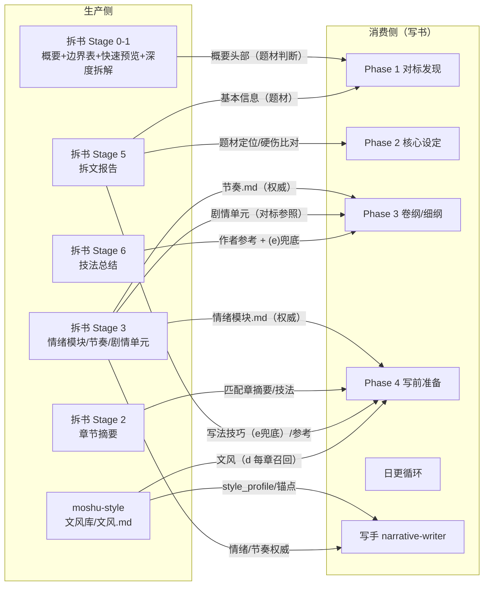

# moshu-style 独立文风技能 功能文档（定稿讨论稿）

> 状态：📋 讨论定稿，待开发（2026-08-18）
> 背景：文风被"写作风格（表达层）+ 拆解结论（结构层）"两类资产捆绑在拆书 Stage 6。
> 决策：文风拆分为独立技能 moshu-style（纯表达层，任意量原文可学）；拆书 Stage 6 改名"技法总结"（保留结构层结论）；写书消费侧统一改指。

---

## 一、最终架构

```
┌─ moshu-style（新独立 skill）────────────────────────────┐
│  原文（文件/粘贴）→ 文风库/文风.md                        │
│  纯表达层：句长/标点/段落节奏/对话技法/锚点片段/基础层建议   │
│  轻量自包含：部分原文即可，分钟级                          │
└──────────────────────────────────────────────────────┘
                    ↓ 写作消费（每章文风召回）
┌─ 拆书 Stage 0-6（改造）────────────────────────────────┐
│  Stage 0-5 不变（情绪模块.md/节奏.md/拆文报告）           │
│  Stage 6 改名：拆文库/{书}/技法总结.md                    │
│  情绪交替模式 + 可借鉴技巧 + 分层建议（基础/进阶/适配）+ 不可模仿 │
│  （句长/标点/对话/锚点 迁出至文风库）                     │
└──────────────────────────────────────────────────────┘
                    ↓ 写作消费（情绪/节奏/技法兜底）
┌─ 写文消费（改造后）─────────────────────────────────────┐
│  (a)(b) 情绪/节奏 → 拆书 Stage 3（不变）                 │
│  (d) 文风召回     → 文风库/文风.md（唯一来源）+ 交互提醒    │
│  (e) 技法兜底     → 拆文报告写法技巧（改指）               │
└──────────────────────────────────────────────────────┘
```

## 二、moshu-style 技能设计

### 定位

- 触发：`/moshu-style`、`/学文风`、自然语言（"帮我学一下这本书的文风"）
- 产出：`文风库/文风.md`（项目根 `文风库/` 目录；单文件，不按书名分目录——写书文风前后统一，一本一风）
- 核心价值：① 判断一本书值不值得全量拆解（先学风再决定）；② 写作风格基准（写文每章召回）

### 流程草案

```
/moshu-style 触发
  ├─ ① 询问：想学哪本书/哪段文字的文风？（书名 + 来源）
  │     来源两选：本地文件路径 | 粘贴文本
  │     （链接抓取 = 后续增强，复用 moshu-cdp；第一版不做——拆书同样没有链接处理）
  ├─ ② 获取内容：
  │     本地文件 → 读取；非 UTF-8（GBK/GB18030）先转码 UTF-8（学拆文原文备份逻辑）
  │     粘贴文本 → 保存到 文风库/_source.md（保留原文供锚点回查）
  ├─ ③ 轻量内容准备（不强制 chapter_boundary.py——那是整本书连续性校验）：
  │     有章节结构 → 简化切分（空行/分隔符/手动指定行号），选 2-3 段样本（各 ~1000 字）
  │     无结构（粘贴片段）→ 整段当样本；片段 <800 字 → 提示用户补充或接受低置信
  ├─ ④ 文风分析（复用表达层方法论，见第三部分模板）：
  │     句长/标点/段落节奏 → 跨平台 Python 1-liner 确定性统计（学 style-profile-generator Step E2）
  │     对话技法 → 从样本原文直接归纳（潜台词/标签习惯/角色语气区分）
  │     锚点 2-4 段 → 对话+动作交织段落，逐字连续切片，行号可回查
  │     分层建议·基础层 → 词汇/句式/描写/对话习惯（可选）
  ├─ ⑤ 落盘：文风库/文风.md（模板见第三部分；覆盖前确认——旧文风被替换）
  └─ ⑥ 报告 + 衔接提示：
         - 文风可用于写作（写前准备 (d) 自动召回）
         - 如要完整对标（情绪模块/节奏）：跑 /moshu-analyze 全量拆解
         - 重复学习同一本书 → 直接覆盖（文风唯一）
```

### 产出规范（文风库/文风.md 模板）

```markdown
# {书名} 文风

## 生成记录
- 来源：{本地文件路径 / 粘贴 / 其他}
- 抽样：{第 K1/K2/K3 段 或 章节，各约 1000 字；粘贴片段标注"整段样本"}
- 生成时间：{date}
- 文风可用：是  # 原文缺失/锚点不足 → 否：原因

## 整体语感
- 句长分布：{短<15字 X% / 中15-30 Y% / 长>30 Z% / 平均 N 字 / 标点密度 M%}（Python 1-liner 确定性统计）
  - confidence: high | med | low
- 标点习惯：{破折号/省略号/句号/感叹号高频用法 + 2-3 个原文短示例}
  - confidence: high | med | low
- 段落节奏：{平均段长、单段单动作 vs 多动作堆叠、断行习惯}
  - confidence: high | med | low

## 对话技法
- 潜台词模式：{2-3 种典型手法（问非所答/语气反差/信息隐瞒），每种附 1 段原文示例}
  - confidence: high | med | low
- 对话标签习惯：{说话动词多样性、动作替代标签频率、对话与动作穿插比例}
- 角色语气区分：{主角和 1-2 个核心配角的句式差异，引用原文样本句（样本不足可省略）}

## 原文锚点片段
> 每段 300-500 字，写作时当 few-shot 范例；逐字连续切片，行号可回查；模仿手法不抄字句。
### 片段 A — 基调：{紧张/悲伤/轻松/热血…}
**出处**：{来源位置（文件行号或粘贴片段段落号）}
**示范点**：{句长节奏/标点位置/潜台词手法…}
```
{300-500 字原文}
```
（共 2-4 段，按样本实际基调分布选；某基调样本不足写明跳过，不编造）

## 分层模仿建议·基础层（可选）
- {词汇偏好、句式节奏、对话标签、描写重心中最容易迁移的 3-5 条；只学表达习惯，不复制原句}
```

**明确不含**（属于拆书技法总结）：情绪交替模式、可借鉴技巧 Top5/Top3、分层建议进阶层/适配层、不可模仿。

## 三、拆书改造

### Stage 1 停靠点

- **移除**表达层文风生成（回退为：快速预览 + 深度拆解轻检查 + 停靠询问）
- 依赖 `style-profile-*` 的引用一并移除

### Stage 6 改名"技法总结"

- 产出：`拆文库/{书名}/技法总结.md`
- 内容（de 保留项）：
  - **情绪交替模式**：章内基调切换（摘要情节点基调序列统计）+ 跨章基调周期（前 20 章章基调序列）+ 喜剧↔重击转场手法——依赖 Stage 2 摘要
  - **可借鉴技巧**：写法技巧 Top5 + 可借鉴套路 Top3——从拆文报告引用（Stage 5）
  - **分层模仿建议**：基础层 + 进阶层 + 适配层整体保留（基础层与文风内容重叠但作为应用建议完整保留）
  - **不可模仿**：对标书缺陷/不适合技法
- 输入：拆文报告.md（阻断级）+ 章节/*_摘要.md + 深度拆解（质量输入）
- 每段标 confidence；生成记录含 `技法可用：是/否`
- 新增 `references/technique-summary-sop.md`（或改写 style-profile-generator 的结构层部分），`style-profile-protocol.md` / `style-profile-generator.md` 迁出至 moshu-style（跨 skill 不引用——拆书不再引用文风文档）

### Stage 表更新

| 阶段 | 名称 | 输出 | 完成标志 |
|---|---|---|---|
| 0-5 | 不变 | 不变 | 不变 |
| 6 | 技法总结 | 技法总结.md | 落盘 `拆文库/{书名}/技法总结.md` |

## 四、写书消费侧改造（主要消费点 9 处）

| # | 位置 | 改造 |
|---|---|---|
| 1 | **workflow-chapter (d) 文风召回**（重写） | 查找链简化为**唯一来源**：`文风库/文风.md`；移除 设定/文风.md 自定义模式、移除对标/拆文库回退；**交互设计**见第五节 |
| 2 | workflow-chapter (e) 匹配章回退 | "文风文件里的可借鉴技巧" → "**拆文报告**里的写法技巧"（Stage 5 已有，少一层中间产物） |
| 3 | explorer benchmark_style_load | 读文风路径：`文风库/文风.md`（不再走对标书路径查找）；`profile_missing`/`profile_degenerate` 判定基于文风库 |
| 4 | narrative-writer 模板 | 66/200 行"对标 文风.md"措辞 → "文风库/文风.md"；文风自检来源顺序简化（style_profile_summary → 文风库句长分布 → 锚点语感） |
| 5 | workflow-daily | custom_style 分支（设定/文风.md 相关）移除，改为文风库语义；spawn 字段 style_profile_path 来源 = 文风库 |
| 6 | recovery-protocol | 文风缺失/退化行 → 修复指令 `/moshu-style`；查找链同步 |
| 7 | **import-workflow Step 10 文风同步**（细化） | ① 同步对象改为 **技法总结.md**：`拆文库/{对标书名}/技法总结.md` → `{项目}/对标/{对标书名}/技法总结.md`（同拆文报告待遇，随拆文库走）；② 文风库 = **项目级文件**（项目根），import 不复制、不覆盖；③ 绑定外部对标且 `文风库/文风.md` 缺失 → 导入报告提示「用 /moshu-style 学习 {对标书名} 文风」；④ structure-mapping-long 400 行映射表同步（文风.md 行改技法总结.md） |
| 8 | moshu 路由表 + marketplace.json | 加 `/moshu-style` 入口（路由表：学文风/风格 → moshu-style） |
| 9 | CHANGELOG | v1.1.2 记录本架构变更 |

### 已核实零改动（2 项）

- **moshu-review**：review-log 的"文风/节奏类写作建议"机制**独立于文风来源**（S3/S4 建议进 review-log，与拆书文风无文件级依赖）——审查不读文风文件，无需改造
- **moshu-deslop**：anti-ai-writing.md 349 行「题材文风优先：文风对标有帮助，但必须来自目标题材/本书文风指纹」是**方法论原则**，不读具体文风文件；新架构下文风库即"本书文风指纹"来源，语义天然成立（anti-ai-writing 三副本同）

## 四·六、完整引用清单（全仓 grep 基准——实施时逐项核对，防漏）

> 全仓 `文风.md / 设定/文风.md / 对标文风` 共 98 处引用。下表按文件分组列出**需要改动**的引用点（历史 CHANGELOG 记录与纯方法论原则除外）。实施时以本表 + 新 grep 双核对。

### moshu-write（写作侧 9 文件）

| 文件 | 行 | 内容 | 处理 |
|---|---|---|---|
| SKILL.md | 73 | 首次引用对标书复制规则含 `文风.md` | 复制清单去掉文风.md（文风库独立）；补"文风见 文风库/文风.md" |
| references/artifact-protocols.md | 98-99 | 资产表两行：`设定/文风.md`（自定义）、`对标/{书名}/文风.md` | 合并/替换为 `文风库/文风.md` 一行（来源 moshu-style；消费：Phase 4 每章 (d)） |
| references/workflow-setup.md | 33 | 首次引用对标书复制规则（含文风） | 同 SKILL.md 73 |
| references/workflow-setup.md | 116 | 题材正文提示卡"不覆盖 `设定/文风.md`" | → "不覆盖 文风库/文风.md" |
| references/workflow-daily.md | 46 | 续写状态卡"文风每章从 `设定/文风.md` / 对标文风读取" | → "文风每章从 `文风库/文风.md` 读取" |
| references/workflow-daily.md | 75-79 | custom_style 分支（no_benchmark/profile_missing/profile_degenerate） | 移除 custom_style 语义 → 文风库存在性分支（见交互设计第五节） |
| references/workflow-chapter.md | 39 | 题材卡"不覆盖 `设定/文风.md`" | → 文风库/文风.md |
| references/workflow-chapter.md | 40 | (d) 文风召回（重写，见四-1） | 重写 |
| references/workflow-chapter.md | 41 | (e) 回退"文风文件里的可借鉴技巧" | → 拆文报告写法技巧 |
| references/workflow-chapter.md | 49 | 快捷路径"主会话另行直接读 `设定/文风.md`" | → 读 文风库/文风.md |
| references/workflow-chapter.md | 101 | 缺失处理 4"有对标书但文风.md 缺失…自定义文风" | 重写为文风库缺失交互 |
| references/workflow-chapter.md | 108 | 权威优先级 3"自定义文风 设定/文风.md 优先级高于对标文风" | 简化为"文风库/文风.md 只管风格，不覆盖情绪/节奏" |
| references/writing-craft.md | 298 | "先读本书 `设定/文风.md`、对标拆文…" | → "先读 文风库/文风.md、对标拆文…" |
| references/style-genre-modules.md | 35 | "本书文风来自 `设定/文风.md` 或对标 `文风.md`" | → "来自 文风库/文风.md" |
| references/genre-prose-cards.md | 88 | "`设定/文风.md` 或对标 `文风.md`，确认句长…" | → "文风库/文风.md，确认句长…" |
| references/anti-ai-writing.md | 349 | "文风对标有帮助，但必须来自目标题材/本书文风指纹" | 语义不变（方法论原则），可不动；如改：→ "文风（文风库）有帮助…" |
| references/recovery-protocol.md | 51,58,61 | 文风缺失/退化 | 见四-6 |

### moshu-setup（agent 模板 + 共享副本，4 文件）

| 文件 | 行 | 内容 | 处理 |
|---|---|---|---|
| templates/agents/moshu-explorer.md | 43,76,152,173,298,311 | benchmark_style_load 读文风（含输出 JSON source_files 示例） | 读文风路径 → 文风库/文风.md；source_files 示例同步 |
| templates/agents/moshu-narrative-writer.md | 66,200,202 | 文风路径/自检来源（自定义→对标回退） | 简化：文风路径 = 文风库/文风.md；自检来源顺序简化 |
| templates/agents/moshu-architect.md | 62 | "主对标书决定日更默认调用哪本文风" | 新架构下文风与主对标解耦（文风库项目级）——表述改"主对标书决定情绪/节奏权威"，文风统一走文风库 |
| references/agent-references/{genre-prose-cards,style-genre-modules,writing-craft}.md | 88,35,298 | 同 moshu-write 三文件 | **共享副本**：改源文件后经 sync-shared-assets 同步（shared-files 守卫强制字节一致） |
| references/agent-references/anti-ai-writing.md | 349 | 同 moshu-write | 同上 |

### moshu-analyze（拆书侧，属"拆书改造"章节，此处列引用点）

| 文件 | 行 | 内容 | 处理 |
|---|---|---|---|
| references/analyze-workflow.md | 84,105,125,151,154 | 拆文库结构/Stage 6/Stage 1 停靠点（表达层文风） | Stage 1 移除表达层；Stage 6 → 技法总结 |
| references/output-templates.md | 547 | Stage 6 文风模板节 | → 技法总结模板节 |
| references/style-profile-protocol.md / style-profile-generator.md | 全 | 文风协议/生成 SOP | **迁出至 moshu-style**（新技能 references），拆书不再引用 |
| SKILL.md | — | 引用 style-profile-* | 移除引用 |

### moshu-import（导入侧）

| 文件 | 行 | 内容 | 处理 |
|---|---|---|---|
| SKILL.md | 48 | Phase 3 步骤清单含"文风" | → "技法总结" |
| references/import-workflow.md | 102,143,160 | 拆文库结构/Stage 6 名称"文风.md" | → 技法总结.md（Stage 6 改名） |
| references/import-workflow.md | 358-365 | Step 10 文风同步 | 见四-7 |
| references/structure-mapping-long.md | 400 | 同步映射表 文风.md 行 | → 技法总结.md 行 |

### 项目文档

| 文件 | 行 | 内容 | 处理 |
|---|---|---|---|
| README.md / README_EN.md | 174/170 | 项目结构 `对标/{书}/文风.md` | 结构图更新：对标/ 下改技法总结.md；补 文风库/文风.md 行 |
| moshu-setup/UPGRADING.md | 75 | "无外部对标时只跳过对标模块、节奏和文风召回" | 语义核对（文风不再依赖对标），可微调 |

### 方法论原则（零改动，语义天然成立）

- moshu-write/deslop/review + agent-references 的 anti-ai-writing.md:349「题材文风优先」——不读具体文件，仅原则表述

## 四·七、交互与引导设计（每个用户触点的提示文案）

> **原则**：引用点改造 ≠ 机械替换路径。凡"用户可感知的触点"（操作步骤、报告、结构展示），必须附带引导文案——告诉用户文风现在在哪、怎么生成、缺了怎么办、何时需要。模型内部技术描述则改路径 + 保证语义自洽（补一句"文风库/文风.md = moshu-style 产出"）。

### 触点 1：开书 / 对标发现（workflow-setup Phase 1 + SKILL.md 路径术语）

- **复制规则改造**：首次引用对标书复制清单**不再含 文风.md**（章节/角色/剧情/设定/节奏/情绪模块/拆文报告照旧）
- **新增引导**（选定主对标书后，AskUserQuestion 问一次，可跳过不强制）：

> 「主对标书已登记：{书名}。它的**文风**（句长/标点/对话/锚点的写作风格基准）由 `文风库/文风.md` 提供——这是独立于拆书的轻量资产（`/moshu-style` 生成，任意量原文即可学，约几分钟）。」
>
> 选项：**现在用 /moshu-style 学习这本书的文风** / **先跳过**（写第一章时若文风缺失会再次提醒）

- **文案要点**：告知文风的位置（文风库）、来源（/moshu-style）、与对标书资产的分离（对标复制不含文风）、缺了会在何时再提醒

### 触点 2：写前准备 (d) 文风召回（每章，核心交互）

- 已设计（见第五节）：两级检查（存在性 + 合规性）→ 缺失/不合规 → AskUserQuestion 三选项（生成 / 跳过记录 / 自写约束引导）
- 补充：`文风可用：否`（生成记录标记）→ 按"不合规"处理，提示重新生成

### 触点 3：explorer benchmark_style_load（日更自动路径）

- `gaps.profile_missing: true`（文风库缺失）→ 主会话**不得静默跳过**，按触点 2 的交互提醒用户
- `gaps.profile_degenerate: true`（锚点缺失/文风可用：否）→ 提醒"文风不可用（锚点缺失），建议重跑 /moshu-style"；用户确认后按默认 Gate 写

### 触点 4：moshu-import 导入（Step 10 同步后）

- **导入完成报告**（绑定外部对标时）追加：

> 「外部对标 {对标书名} 的拆解资产已同步（含 技法总结.md）。**文风未随拆文库同步**——写作风格基准统一由 `文风库/文风.md` 提供：如需，运行 `/moshu-style` 学习 {对标书名} 的文风。」

- 本书导入（无外部对标）：不提示文风相关内容

### 触点 5：moshu-style 完成时（技能自身收尾）

- **产出报告**：

> 「文风已生成：`文风库/文风.md`（来源：{来源}，抽样：{抽样}）。写作时每章自动召回（写前准备文风召回）。如需完整对标（情绪模块/节奏），运行 `/moshu-analyze` 全量拆解这本书——技法总结会补充拆解结论。」

- **覆盖确认**：`文风库/文风.md` 已存在 → 确认后覆盖（AskUserQuestion："替换现有文风？"）

### 触点 6：项目结构展示（README / 资产表）

- `文风库/文风.md` 注释：`# /moshu-style 生成；每章写作前文风召回`
- `对标/{书}/技法总结.md` 注释：`# 拆书 Stage 6 产出（情绪交替/可借鉴技巧/分层建议）`

### 模型内部技术描述（无用户提示，路径替换 + 语义自洽）

- workflow-chapter 39/49/108、writing-craft:298、style-genre-modules:35、genre-prose-cards:88、narrative-writer 66/200/202、explorer JSON 示例、anti-ai-writing:349——改路径/表述为 `文风库/文风.md`，需要时补一句"（文风库 = /moshu-style 产出）"保证读者（模型）知道来源，不产生悬空引用

## 四·五、老项目兼容（新增）

- 旧拆文库/ 或 对标/{书}/ 下的 `文风.md` **不再被消费**（查找链唯一 = 文风库）
- 已部署项目迁移：把旧文风文件复制为 `文风库/文风.md`（一次手动操作），或直接重跑 `/moshu-style` 重新学习
- import 老项目时：Step 10 按新规则执行（技法总结同步 + 文风库缺失提示）

## 五、交互设计（写章节发现无文风）——核心体验

**检查时机**：写前准备 (d) 文风召回时（每章必做；开书 Phase 4 / 日更 / 写指定章同路径）。

**检查内容（两级）**：
1. **文件存在性**：`文风库/文风.md` 是否存在
2. **内容合规性**：
   - 非空且非占位 stub（待办/待补充/___、仅标题）
   - `文风可用：是`（生成记录字段）
   - 锚点 ≥1 段（few-shot 核心）

**缺失/不合规时**（AskUserQuestion，一次问清）：

> 「当前项目没有可用文风（`文风库/文风.md` 缺失或不合规）。文风是正文风格基准（句长/标点/对话/锚点），缺失时写作将退回默认 Gate——AI 腔风险上升。」
>
> 选项：
> - **用 /moshu-style 生成**（推荐）→ 执行 moshu-style 流程后继续本章写作
> - **跳过，用默认 Gate 写** → 本章写作继续，`文风缺失` 记入报告；下一章写前再次提醒（不静默）
> - **自己写一段风格约束**（可选保留）→ 提示"把约束粘贴给我，或直接 /moshu-style 学习你的文风"（引导向文风库，不另设机制）

**设计原则**：提醒但不硬阻断（作者知情选择 = 品味决策）；不静默（每章写前都检查，跳过也要明确记录）；引导唯一出口（/moshu-style）。

**explorer 路径**：部署了 explorer 的日更走 benchmark_style_load——`gaps.profile_missing: true`（文风库缺失）时主会话按上述交互提醒，不自动跳过。

## 六、守卫与同步清单

| 项 | 动作 |
|---|---|
| shared-assets.json | style-profile-protocol/generator 若登记为共享组 → 迁出拆书后更新清单 |
| static-check | 拆书移除文风文档引用（跨 skill 引用禁止）后验证 |
| check-current-skill-contracts | 若契约含"文风"相关断言 → 同步 |
| marketplace.json | 新增 moshu-style 插件条目（category: novel-polish 或 novel-analysis） |
| doc-budget | 无影响（文风/技法均为冷路径） |
| skill-numbering | 新 SKILL.md 遵守 Step/Phase 编号规范 |

## 六·五、拆书-写书整体流程与生产-消费关系（改造后全景）

> 目的：明确每一步怎么用、谁生产、谁消费、何时消费、强度如何——避免"产物存在但没人消费"或"消费点找不到来源"。

### 生产-消费全景图



### 完整映射表（产物 × 消费）

| 产物 | 生产者 | 消费方 | 消费时机 | 强度 | 缺失后果 |
|---|---|---|---|---|---|
| 概要.md | 拆书 Stage 0 | 写书对标发现（题材判断） | 开书时 | 🟢 轻 | 对标发现改读拆文报告 |
| 章节边界表（_progress.md） | 拆书 Stage 0 | 拆书自身 Stage 1/2/6（切片真值） | 管道内 | 🔴 内部硬依赖 | 拆书停摆 |
| 快速预览.md | 拆书 Stage 1 停靠 | **用户决策**（拆不拆/当不当对标） | 停靠时 | 🟢 用户 | 无（决策辅助物） |
| 黄金三章深度拆解 | 拆书 Stage 1 | 拆书 Stage 6（对话/开篇技法） | 管道内 | 🟡 内部 | Stage 6 降级 |
| 章节摘要 | 拆书 Stage 2 | 写书匹配章 (e) + 拆书 Stage 3/6 | 写前准备/管道内 | 🔴 写书 (e) 每章 | 匹配章缺失 → 降级 |
| 情绪模块.md | 拆书 Stage 3 | 写书 (a) + 写手 | 写前准备/每章 | 🔴 权威 | missing_primary_contract 停 |
| 节奏.md | 拆书 Stage 3 | 写书卷纲 + (b) + 写手 | 卷纲/写前准备 | 🔴 权威 | 同上 |
| 剧情单元 | 拆书 Stage 3 | 写书卷纲剧情单元卡 | Phase 3 | 🟡 中 | 无对标参照 |
| 设定/角色 | 拆书 Stage 4 | 写书 (f) 模块召回 | 写前准备 | 🟡 中 | 跳过可选 |
| 拆文报告.md | 拆书 Stage 5 | 写书 Phase 2/3/4 + (e) 兜底 + 对标发现 | 多处 | 🟡 中高 | 兜底改指技法总结 |
| **技法总结.md** | 拆书 Stage 6（改名） | **作者阅读参考** + (e) 兜底 | 卷纲/阅读 | 🟢 低 | 无硬影响 |
| **文风库/文风.md** | **moshu-style** | 写书 (d) 每章 + 写手自检 + explorer | 写前准备/每章 | 🔴 核心 | 交互提醒（可跳过） |

### 流程衔接优化点（本改造一并落地）

**O1：拆书 Stage 1 停靠点 = 三分支决策点（新增衔接）**
- 现状：停靠点只问"继续全量拆 / 就到这里"
- 改造：加第三个引导——「这本书要不要生成文风？」（`/moshu-style`，任意量原文，几分钟）
  - 选"仅文风"→ 走 moshu-style（停靠点直接衔接，不另起会话）
  - 全量拆完的用户：Stage 6 技法总结照常，文风库如有则保留（拆书不再产文风）
- 意义：拆书停靠点成为"这本书价值判断"的出口——快速预览（值不值得拆）+ 文风（值不值得学）+ 全量拆（值不值得对标），三档决策一次完成

**O2：快速预览定位明确（不强制写书消费）**
- 快速预览 = 用户决策辅助物（写书零消费，已核实）——保留不强制消费，避免为"没人读"的产物加消费点

**O3：技法总结避免与拆文报告三层重叠（减肥）**
- 拆文报告已有：全书情绪节奏总览（= 情绪交替）+ 写法技巧/可借鉴套路（= 可借鉴技巧）
- 技法总结专注**应用视角**：分层模仿建议（基础/进阶/适配）+ 不可模仿 + 可借鉴技巧**索引**（引用拆文报告段落，不重复生产全文）——情绪交替直接引用拆文报告「全书情绪节奏总览」，不重复统计
- 意义：Stage 6 变轻（合成视图而非重复生产），三份产物的分工清晰：情绪模块/节奏 = 机器权威，拆文报告 = 人类总览，技法总结 = 应用建议

**O4：文风在开书流程的引导（触点 1 已设计）**
- 对标发现选定主对标后：询问是否 /moshu-style 学习文风（可跳过）
- 无对标项目：文风可选（moshu-style 学任意书/自己的风格），不再依赖对标存在

**O5：写书消费顺序与来源最终形态（含大纲三层）**
```
开书：对标发现（拆文库概要/拆文报告）→ 登记主对标 → 文风引导（moshu-style）
大纲层①：全书体量与阶段总览（八节点占比自排/阶段划分/钩子链——理论驱动，不消费拆书）
大纲层②：卷纲（节奏.md 权威迁移 → 情绪模块.md 单元引擎校准 → 剧情单元对标参照
          → 拆文报告硬伤修正）
大纲层③：大纲.md（卷纲完成后汇总全书鸟瞰——纯汇总，不消费拆书）
细纲：剧情单元卡（节拍已固化）→ 章节摘要（钩子灵感，可选）
写前准备：(a)情绪模块 (b)节奏 (c)题材卡 (d)文风库 (e)匹配章 (f)结构化模块
日更：同上 + explorer 自动召回（文风库 + 情绪/节奏 + 匹配章）
写手：情绪/节奏权威 + 文风库（句长/锚点/对话）+ 匹配章技法
```
> **大纲三层消费分工**：只有**卷纲**层消费拆书产物（节奏/情绪模块/剧情单元/拆文报告）；全书总览靠理论占比自排，大纲.md 是纯汇总——拆书对大纲的介入点在卷纲，不在总览。

### 改造后各产物的"一句话定位"

| 产物 | 一句话定位 |
|---|---|
| 概要.md / 快速预览.md | 决策辅助（拆不拆/当不当对标） |
| 章节摘要 | 证据（匹配章 + 拆解语料） |
| 情绪模块.md / 节奏.md | **写作权威**（机器消费） |
| 拆文报告.md | **人类总览**（阅读参考） |
| 技法总结.md | **应用建议**（怎么学这本书） |
| 文风库/文风.md | **风格基准**（每章召回，轻量可得） |

## 七、实施步骤（开发顺序）

1. **建 moshu-style skill**：SKILL.md + references/style-learn-sop.md（从 style-profile-generator 表达层部分迁移改写）+ 产出模板内嵌
2. **拆书改造**：Stage 1 移除表达层；Stage 6 改名"技法总结"（技法总结 SOP + analyze-workflow Stage 表 + 输出模板）；style-profile-* 迁出
3. **写书消费改造**：9 处清单逐项
4. **交互验证**：testProject 实跑一遍"无文风写章节 → 提醒 → /moshu-style 生成 → 继续写"
5. **守卫**：static-check / contracts / numbering / shared-assets 全绿
6. **文档**：CHANGELOG + 路由表 + marketplace

## 八、边界与遗留

- 链接抓取：后续增强（复用 moshu-cdp），第一版不做
- 文风库多书支持：不做（写书文风唯一，前后统一；换书学习 = 覆盖）
- 上游对照：上游无此架构（文风仍在拆书），mo-shu 独立演进
- 老项目兼容：拆文库/ 下旧 文风.md 不再被消费（查找链唯一）；如需要迁移到文风库（一次复制）
